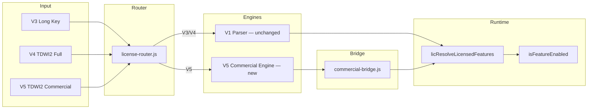

# Phase 2.1+ — Commercial Licensing Architecture (Post-Release Roadmap)

**الإصدار:** 1.2.0-approved  
**التاريخ:** 18 يونيو 2026  
**الحالة:** ✅ **مرجع معماري طويل الأمد — معتمد نهائيًا — Phase 2.1 جاهز**  
**التقييم:** 9.6/10 → **10/10** بعد دمج مراجعة v1.2  
**السياق:** بعد اعتماد RC — Commercial Layer فوق V1 — توافق عكسي 100%

---

## جدول المحتويات

1. [الملخص التنفيذي](#1-الملخص-التنفيذي)
2. [المبادئ غير القابلة للتفاوض](#2-المبادئ-غير-القابلة-للتفاوض)
3. [مقارنة: النظام الحالي vs المقترح](#3-مقارنة-النظام-الحالي-vs-المقترح)
4. [نظام المعرفات الثابتة (ID System)](#4-نظام-المعرفات-الثابتة-id-system)
5. [هندسة الـ Registries](#5-هندسة-الـ-registries)
6. [تصميم V5 — أفضل بنية للمفتاح القصير](#6-تصميم-v5--أفضل-بنية-للمفتاح-القصير)
7. [Custom Package (C104) — حل المفاتيح الطويلة](#7-custom-package-c104--حل-المفاتيح-الطويلة)
8. [عمليات الترخيص والترقية](#8-عمليات-الترخيص-والترقية)
9. [Opt-in: Diagnostics و Developer](#9-opt-in-diagnostics-و-developer)
10. [تصميم الواجهات](#10-تصميم-الواجهات)
11. [Templates والـ Presets](#11-templates-والـ-presets)
12. [التوافق مع V1 — الجسر (Bridge)](#12-التوافق-مع-v1--الجسر-bridge)
13. [قابلية التوسع المستقبلية](#13-قابلية-التوسع-المستقبلية)
14. [تحسينات مقترحة على التصميم الأصلي](#14-تحسينات-مقترحة-على-التصميم-الأصلي)
15. [خطة التنفيذ المرحلية](#15-خطة-التنفيذ-المرحلية)
16. [تقييم المخاطر](#16-تقييم-المخاطر)
17. [معايير الاعتماد](#17-معايير-الاعتماد)
18. [مراجعة المعمارية v1.1](#18-مراجعة-المعمارية-v11--التحسينات-المعتمدة)
19. [مراجعة المعمارية v1.2 — الاعتماد النهائي](#19-مراجعة-المعمارية-v12--الاعتماد-النهائي)
20. [التقييم المعماري](#20-التقييم-المعماري)

---

## 1. الملخص التنفيذي

### الهدف

تحويل نظام التراخيص إلى **منصة تجارية احترافية** تدعم الباقات، الاشتراكات، الترقية، والتجديد — **بدون المساس بـ V1**.

### القرار المعماري المركزي

```
┌─────────────────────────────────────────────────────────────┐
│  Commercial Layer (جديد — Phase 2.1+)                        │
│  Registries · V5 Codec · Drawer · License Registry         │
└──────────────────────────┬──────────────────────────────────┘
                           │ Bridge فقط
┌──────────────────────────▼──────────────────────────────────┐
│  V1 Runtime (بدون تغيير منطق)                                 │
│  FEATURE_REGISTRY · isFeatureEnabled · licResolveLicensed...  │
│  V3/V4 validation · licCollectFeatureSelection               │
└─────────────────────────────────────────────────────────────┘
```

### ما يتغير للعميل

| قبل (V1) | بعد (Commercial Layer) |
|----------|-------------------------|
| اختيار 64 checkbox يدويًا | اختيار باقة جاهزة |
| Custom = مفتاح V3 طويل (مئات الأحرف) | Custom = `TDWI2-CP104-…` (25 حرف) |
| لا سجل تراخيص | License Registry كامل |
| لا ترقية رسمية | Upgrade / Renew / Extend |

### ما لا يتغير

- كل مفتاح V3/V4/Legacy **يعمل كما هو**
- كل `Feature Key` (`book_schedule`, …) **ثابت**
- `isFeatureEnabled()` **بدون تعديل**
- `FEATURE_REGISTRY` في `index.html` **يبقى مصدر التشغيل**

---

## 2. المبادئ غير القابلة للتفاوض

| # | المبدأ | التحقق |
|---|--------|--------|
| B1 | **Extension وليس Rewrite** | ملفات جديدة في `license/` فقط |
| B2 | **Backward Compatible 100%** | اختبار: تفعيل 10 مفاتيح V3/V4 قديمة بعد كل Phase |
| B3 | **لا تعديل** `isFeatureEnabled` / `licResolveLicensedFeatures` / `licCollectFeatureSelection` | مراجعة diff = 0 سطر |
| B4 | **لا تعديل** `FEATURE_REGISTRY` | IDs الرقمية في JSON منفصل |
| B5 | **V3 + V4 Supported forever** | Router يوجّه حسب صيغة المفتاح |
| B6 | **Feature IDs ثابتة** | تُعيَّن مرة — لا إعادة ترقيم |
| B7 | **Opt-in دائمًا معطّل** | حتى Ultimate و Full Edition |
| B8 | **Phase 2.1 معتمد** — التنفيذ بعد Code Freeze | v1.2.0-approved |
| B9 | **registrySig إلزامي** — لا Registry بدون توقيع | Phase 2.1 |
| B10 | **Activation Bundle إلزامي** — العميل لا يعتمد على Registry | Phase 2.2 |

---

## 3. مقارنة: النظام الحالي vs المقترح

### 3.1 جدول مقارنة شامل

| المحور | V1 (الحالي) | Commercial Layer (المقترح) |
|--------|-------------|---------------------------|
| **تعريف الخصائص** | `FEATURE_REGISTRY` — string keys | + `feature-registry.json` — numeric IDs |
| **التشغيل** | `isFeatureEnabled('book_schedule')` | **نفس الدالة** — Bridge يحوّل IDs → keys |
| **الباقات** | غير موجودة — Full أو Custom يدوي | `package-registry.json` — Package 01–05, 99 |
| **الاشتراك** | `lic-gen-type` (trial, annual, …) | `subscription-registry.json` — IDs 01–09 |
| **المفتاح القصير** | V4 `TDWI2` — Full فقط (25 حرف) | V5 `TDWI2` — كل الباقات (25 حرف) |
| **المفتاح الطويل** | V3 — Custom مع features مدمجة | **يُستبدل تدريجيًا** بـ Custom Registry |
| **سجل التراخيص** | لا يوجد | `license-registry.json` |
| **الترقية** | يدوية — إعادة توليد كامل | Upgrade codes رسمية |
| **واجهة التوليد** | نموذج في تبويب Renew | Drawer 6 خطوات |
| **Templates** | لا | Hijama Starter, Clinic Medium, … |
| **الأمان** | HMAC + featureSig + XOR | نفس المفاتيح + MAC V5 + registry |
| **السيرفر** | غير مدعوم | نقاط ربط جاهزة (Phase 4+) |

### 3.2 نقاط القوة المحفوظة من V1

```
✅ 72 خاصية granular مع DOM gating
✅ فصل License vs RBAC
✅ V4 قصير للإصدار الكامل
✅ HMAC anti-tamper للـ Custom
✅ licToggleRuntimeFeature للـ opt-in
✅ Legacy bundle migration
✅ لوحة مطور + Diagnostics
```

### 3.3 الفجوات التي يغلقها Commercial Layer

```
❌ → ✅ لا باقات جاهزة للبيع
❌ → ✅ Custom = مفتاح طويل غير عملي
❌ → ✅ لا تتبع تجاري (عميل، شركة، تاريخ)
❌ → ✅ لا ترقية رسمية مع الاحتفاظ بالـ expiry
❌ → ✅ لا templates لقطاعات مختلفة
❌ → ✅ لا metadata (devices, branches)
```

### 3.3 مخطط التعايش



---

## 4. نظام المعرفات الثابتة (ID System)

### 4.1 قاعدة الترقيم الموحّدة (v1.1 — معتمد)

> **قرار معتمد:** Feature IDs **متسلسلة** حسب ترتيب `FEATURE_REGISTRY` — التصنيف في حقل `category` فقط، وليس في نطاق الرقم.

| النوع | النطاق | الصيغة | مثال |
|-------|--------|--------|------|
| **Feature** | 001–072 (حالي) | 3 أرقام متسلسلة | `009` = book_schedule |
| **Feature — جديد** | 073+ | التالي تلقائيًا | `073` = أول ميزة جديدة |
| **Package** | 01–99 | 2 رقم | `03` = professional — **حتى 99 باقة** |
| **Package — Custom** | 99 | ثابت | `99` = Custom (يُحل عبر CPxxx) |
| **Custom Instance** | CP001–CP999 | CP + 3 أرقام | `CP104` = باقة عميل خاصة |
| **Feature Hash** | 4 hex | F + 3 hex | `F92A` = بصمة خصائص Custom |
| **Subscription** | 01–99 | 2 رقم | `05` = annual |
| **Action — Lifecycle** | 01–99 | 2–3 أرقام | `03` = upgrade |
| **Action — Features** | 100–199 | 3 أرقام | `108` = feature_unlock |
| **Action — Admin** | 200–299 | 3 أرقام | `212` = reactivate |
| **Action — System** | 300–399 | 3 أرقام | `313` = suspend |
| **License** | L000001+ | L + 6 أرقام | `L000042` = سجل ترخيص |
| **License UUID** | UUID v4 | داخلي | `fc3a9b2e-…` — ثابت للأبد |

**قواعد Feature ID:**
- الترتيب = ترتيب `FEATURE_REGISTRY` في `index.html` (سطور 19952–20025)
- أي ميزة جديدة = الرقم التالي (`073`, `074`, …) — **لا فجوات، لا إعادة ترقيم**
- `category` (booking, reports, hr, …) **metadata فقط** — لا يؤثر على الرقم

### 4.2 Feature Registry — جدول التعيين المتسلسل (001–072)

> **مرجع المصدر:** `FEATURE_REGISTRY` — `index.html` سطور 19952–20025  
> **قاعدة v1.1:** ترتيب متسلسل 1:1 مع السجل — **لا يتغير أبدًا بعد الاعتماد**.

| ID | Key | category | tier | flags |
|----|-----|----------|------|-------|
| 001 | `core_dashboard` | core | core | — |
| 002 | `core_pos` | core | core | — |
| 003 | `core_clients` | core | core | — |
| 004 | `core_staff` | core | core | — |
| 005 | `core_packages` | core | core | — |
| 006 | `core_users` | core | core | — |
| 007 | `core_settings` | core | core | — |
| 008 | `core_employee` | core | core | — |
| 009 | `book_schedule` | booking | addon | — |
| 010 | `book_confirm` | booking | addon | — |
| 011 | `book_no_show` | booking | addon | — |
| 012 | `dash_book_kpi` | booking | addon | — |
| 013 | `pos_shared_pkg` | pos | addon | unique |
| 014 | `pos_multi_svc` | pos | addon | — |
| 015 | `pos_receipt` | pos | addon | — |
| 016 | `msg_templates` | communication | addon | — |
| 017 | `msg_bulk` | communication | addon | — |
| 018 | `msg_auto` | communication | addon | unique |
| 019 | `msg_retention` | communication | addon | — |
| 020 | `dash_msg_alert` | communication | addon | — |
| 021 | `crm_invoice_search` | crm | addon | — |
| 022 | `crm_search` | crm | addon | internal, hidden |
| 023 | `ops_client_file` | crm | addon | unique |
| 024 | `ops_map_editor` | crm | addon | unique |
| 025 | `rep_monthly` | reports | addon | — |
| 026 | `rep_doctors` | reports | addon | — |
| 027 | `rep_vat` | reports | addon | — |
| 028 | `rep_zreport` | reports | addon | — |
| 029 | `rep_profitability` | reports | addon | — |
| 030 | `rep_sales` | reports | addon | — |
| 031 | `rep_thermal_period` | reports | addon | — |
| 032 | `rep_archive_a4` | reports | addon | unique |
| 033 | `tech_print_pdf` | reports | addon | — |
| 034 | `exp_track` | finance | addon | — |
| 035 | `exp_budget` | finance | addon | — |
| 036 | `dash_exp_kpi` | finance | addon | — |
| 037 | `pkg_bank` | finance | addon | unique |
| 038 | `fin_currency` | finance | addon | unique |
| 039 | `fin_cashfloat` | finance | addon | — |
| 040 | `ops_inventory` | inventory | addon | unique |
| 041 | `att_daily` | hr | addon | — |
| 042 | `att_leave` | hr | addon | — |
| 043 | `hr_leave_requests` | hr | addon | — |
| 044 | `att_overtime` | hr | addon | — |
| 045 | `pay_salary` | payroll | addon | — |
| 046 | `pay_commission` | payroll | addon | unique |
| 047 | `hr_ledger` | payroll | addon | unique |
| 048 | `att_report` | hr | addon | — |
| 049 | `att_policy` | hr | addon | unique |
| 050 | `pkg_commissions` | payroll | addon | — |
| 051 | `hw_drawer` | hardware | addon | — |
| 052 | `hw_thermal` | hardware | addon | — |
| 053 | `hw_status` | hardware | addon | — |
| 054 | `bk_local` | backup | addon | — |
| 055 | `bk_custom` | backup | addon | — |
| 056 | `bk_cloud` | backup | addon | — |
| 057 | `bk_drive` | backup | addon | unique |
| 058 | `tech_import` | developer | addon | unique |
| 059 | `tech_msg_api` | communication | addon | — |
| 060 | `tech_gateway` | developer | addon | **opt-in, dev-only** |
| 061 | `hr_leave_balance` | hr | addon | — |
| 062 | `sys_setup_wizard` | diagnostics | addon | — |
| 063 | `sys_product_tour` | diagnostics | addon | **opt-in** |
| 064 | `sys_health_check` | diagnostics | addon | **opt-in** |
| 065 | `sys_readiness` | diagnostics | addon | — |
| 066 | `sys_integrity` | diagnostics | addon | **opt-in** |
| 067 | `sys_logs` | developer | addon | dev-only |
| 068 | `lux_queue_board` | queue | addon | — |
| 069 | `lux_queue_print` | queue | addon | unique |
| 070 | `lux_queue_display` | queue | addon | — |
| 071 | `lux_vip` | pos | addon | — |
| 072 | `lux_rush` | pos | addon | unique |

**ميزات جديدة مستقبلية:** `073`, `074`, … — تُضاف في نهاية الجدول فقط.

### 4.3 مخطط سجل Feature

```json
{
  "id": "009",
  "uuid": "a7f3c2e1-8b4d-4f9a-9c1e-2d5b8a3f7e6c",
  "key": "book_schedule",
  "name": "جدولة المواعيد",
  "nameEn": "Booking Schedule",
  "category": "booking",
  "capabilityIds": ["cap_booking"],
  "description": "إنشاء وتعديل الحجوزات",
  "defaultPackage": "01",
  "visibility": "public",
  "internal": false,
  "developerOnly": false,
  "optIn": false,
  "unique": false,
  "module": "bookings",
  "page": "bookings",
  "deprecated": false
}
```

> **uuid:** معرّف داخلي ثابت — **لا يُعرض في UI** — يحمي من إعادة الترتيب في أي DB مستقبلية.  
> **id:** للبشر والـ Registries — متسلسل 001–072.

### 4.4 Capability Layer (v1.2)

> **الفرق:** Feature = وحدة تقنية واحدة · Capability = قدرة تجارية مجمّعة.

```
Package 03 (Professional)
    ↓
Capabilities: cap_pos, cap_hr, cap_reports
    ↓
Features: 002, 015, 041, 045, 025, ...
```

**مثال `capability-registry.json`:**

```json
{
  "schemaVersion": 1,
  "registryVersion": "1.0.0",
  "generatedAt": "2026-06-18T00:00:00Z",
  "registrySig": "REQUIRED",
  "capabilities": [
    {
      "id": "cap_pos",
      "internalName": "pos",
      "displayName": "Point of Sale",
      "displayNameAr": "نقطة البيع",
      "featureIds": ["002", "015", "071", "072", "013", "014"],
      "description": "تسجيل الجلسات، الفواتير، VIP، الذروة"
    },
    {
      "id": "cap_booking",
      "internalName": "booking",
      "displayName": "Booking & Scheduling",
      "featureIds": ["009", "010", "011", "012"]
    },
    {
      "id": "cap_hr",
      "internalName": "hr_payroll",
      "displayName": "HR & Payroll",
      "featureIds": ["041", "042", "043", "045", "046", "047", "048", "049", "050"]
    }
  ]
}
```

**حل الباقة عبر Capabilities:**
```
resolvePackage("03")
  → capabilityIds: ["cap_pos", "cap_booking", "cap_hr", "cap_reports"]
  → merge featureIds من كل capability
  → + package.featureIds الإضافية
  → − excludedOptIn
  → Bridge
```

**فائدة:** تعديل POS = تعديل `cap_pos` مرة واحدة — كل الباقات التي تتضمنه تتحدث تلقائيًا.

### 4.5 Package IDs (هوية منفصلة — حتى 99 باقة)

| ID | internalName | displayName | يرث من |
|----|--------------|-------------|--------|
| 01 | `starter` | Starter | — |
| 02 | `standard` | Standard | 01 |
| 03 | `professional` | Professional | 02 |
| 04 | `enterprise` | Enterprise | 03 |
| 05 | `ultimate` | Ultimate | 04 |
| 06 | `developer` | Developer | 05 |
| 99 | `custom` | Custom | — (يُحل عبر CPxxx) |

```json
{
  "id": "03",
  "internalName": "professional",
  "displayName": "Professional",
  "displayNameAr": "احترافي",
  "inherits": "02"
}
```

> **قاعدة:** تغيير `displayName` للتسويق **لا يؤثر** على المفاتيح أو `internalName`.

### 4.5 Subscription IDs

| ID | Key | الأيام | يتجدد |
|----|-----|--------|-------|
| 01 | `trial` | 7 | ❌ |
| 02 | `monthly` | 30 | ✅ |
| 03 | `quarterly` | 90 | ✅ |
| 04 | `semi_annual` | 180 | ✅ |
| 05 | `annual` | 365 | ✅ |
| 06 | `two_years` | 730 | ✅ |
| 07 | `three_years` | 1095 | ✅ |
| 08 | `lifetime` | ∞ | ❌ |
| 09 | `custom` | يدوي | — |

### 4.7 Action IDs (v1.2 — نطاقات موسّعة)

| النطاق | ID | Key | الوصف | الحالة |
|--------|-----|-----|-------|--------|
| **Lifecycle** | 01 | `new` | ترخيص جديد | ✅ Phase 2.2 |
| | 02 | `renew` | تجديد | ✅ |
| | 03 | `upgrade` | ترقية | ✅ Phase 2.4 |
| | 04 | `downgrade` | خفض | Phase 2.4 |
| | 05 | `extend` | تمديد | ✅ |
| | 06 | `repair` | إصلاح | Phase 2.4 |
| | 07 | `developer` | مطور داخلي | ✅ |
| **Features** | 108 | `feature_unlock` | فتح خاصية | 🔒 محجوز |
| | 109 | `feature_lock` | قفل خاصية | 🔒 |
| | 110 | `temporary_unlock` | فتح مؤقت | 🔒 |
| **Admin** | 211 | `trial_extension` | تمديد تجريبي | 🔒 |
| | 212 | `reactivate` | إعادة تفعيل | 🔒 |
| **System** | 313 | `suspend` | تعليق ترخيص | 🔒 |

> **قاعدة:** نطاقات 100+/200+/300+ — إضافة Actions جديدة **بدون إعادة تنظيم** الأرقام الحالية.

### 4.7 تركيبات Upgrade (Upgrade Modes)

| Mode | Action | السلوك |
|------|--------|--------|
| **Upgrade Only** | 03 | باقة ↑ — expiry/devices/branches **بدون تغيير** |
| **Upgrade + Renew** | 03 + 02 | باقة ↑ + expiry جديد من اليوم |
| **Upgrade + Extend** | 03 + 05 | باقة ↑ + إضافة أيام للـ expiry الحالي |
| **Upgrade + Replace** | 03 | باقة ↑ + استبدال subscription type |
| **Upgrade + Lifetime** | 03 + sub 08 | باقة ↑ + expiry = lifetime |

خيارات UI (في **Upgrade Wizard** المستقل):
- ☑ Keep Expiration
- ☑ Keep Devices
- ☑ Keep Branches

> **v1.1:** Upgrade يُنفَّذ عبر **Upgrade Wizard** مستقل — ليس مجرد Action داخل License Builder (انظر §10.6).

---

## 5. هندسة الـ Registries

### 5.0 Registry Versioning (v1.1 — إلزامي)

كل ملف Registry يحتوي **ثلاثة حقول إصدار**:

```json
{
  "schemaVersion": 1,
  "registryVersion": "1.0.0",
  "generatedAt": "2026-06-18T00:00:00Z",
  "migratedFrom": null
}
```

| الحقل | الغرض |
|-------|-------|
| `schemaVersion` | شكل البنية (breaking changes) |
| `registryVersion` | إصدار المحتوى (باقات، features) |
| `generatedAt` | تاريخ آخر توليد/تعديل |
| `migratedFrom` | إصدار سابق عند Migration |

**عند التحديث:** `license-migration.js` يقرأ `registryVersion` ويطبّق transform إن لزم.

### 5.1 لماذا JSON وليس قاعدة بيانات (المرحلة الأولى)

| المعيار | JSON Files | SQLite | Server DB |
|---------|------------|--------|-----------|
| Offline-first | ✅ ممتاز | ✅ جيد | ❌ يحتاج شبكة |
| Electron بساطة | ✅ | متوسط | معقد |
| نسخ احتياطي | نسخ ملف | export | API |
| تعديل باقة | edit JSON | SQL | Admin UI |
| **التوصية Phase 2.1** | **✅ افتراضي** | Phase 3 | Phase 4+ |

### 5.2 هيكل الملفات

```
license/
├── registries/
│   ├── feature-registry.json
│   ├── capability-registry.json    # v1.2 — Capabilities
│   ├── package-registry.json
│   ├── subscription-registry.json
│   ├── action-registry.json        # 01–99, 100+, 200+, 300+
│   └── template-registry.json
│
├── data/
│   ├── license-registry/
│   │   ├── index.json              # فهرس خفيف — لا بيانات ضخمة
│   │   ├── L000001.json            # ترخيص واحد = ملف واحد (v1.2)
│   │   ├── L000002.json
│   │   └── ...
│   ├── custom-packages/
│   │   ├── CP104.json
│   │   └── ...
│   ├── activations/                # Activation Bundles (v1.2)
│   │   ├── L000001.bundle.json
│   │   └── ...
│   ├── audit-log.json              # سجل تدقيق مستقل (v1.2)
│   ├── license-registry.bak
│   └── backup/
│       ├── registries-2026-06-18.json
│       └── index-2026-06-18.json
│
├── migrations/                     # v1.2
│   ├── migrate-1.0.0-to-1.1.0.mjs
│   └── rollback-1.1.0-to-1.0.0.mjs
│
├── engine/
│   ├── feature-resolver.js         # Cache + cacheVersion
│   ├── registry-integrity.js     # registrySig validation
│   └── ...
└── ui/
```

### 5.3 License Registry — Sharded (v1.2)

> **قرار v1.2:** لا ملف `license-registry.json` واحد — **ترخيص واحد = ملف واحد** + `index.json` خفيف.

#### `license-registry/index.json`

```json
{
  "schemaVersion": 1,
  "registryVersion": "1.0.0",
  "generatedAt": "2026-06-18T00:00:00Z",
  "nextLicenseSeq": 100043,
  "nextCustomSeq": 105,
  "count": 2,
  "entries": [
    {
      "licenseId": "L000042",
      "licenseUuid": "fc3a9b2e-4d1a-4f9b-8c2e-1a5b9d3f7e6c",
      "packageId": "03",
      "status": "active",
      "customer": "أحمد محمد",
      "company": "مركز تداوي",
      "expiryDate": "2027-06-18",
      "file": "L000042.json"
    }
  ]
}
```

#### `license-registry/L000042.json`

```json
{
  "schemaVersion": 1,
  "licenseId": "L000042",
  "licenseUuid": "fc3a9b2e-4d1a-4f9b-8c2e-1a5b9d3f7e6c",
  "packageId": "03",
  "customPackageId": null,
  "subscriptionId": "05",
  "actionId": "01",
  "devices": 3,
  "branches": 2,
  "maxUsers": 15,
  "customer": { "name": "أحمد محمد", "phone": "+966…", "email": "…", "company": "…" },
  "commercial": {
    "salesPerson": null,
    "invoiceNumber": null,
    "tags": [],
    "customerType": "retail",
    "source": "direct",
    "campaign": null
  },
  "issueDate": "2026-06-18",
  "expiryDate": "2027-06-18",
  "deviceBinding": "DEVICE_ANY",
  "status": "pending",
  "notes": "عقد سنوي",
  "createdAt": "2026-06-18T10:30:00Z",
  "generatedBy": "activation_admin",
  "keys": [{ "version": "V5", "key": "TDWI2-P03-K7H9P-T9389-8VPMP" }],
  "upgradeHistory": [],
  "renewHistory": [],
  "activationBundleRef": "activations/L000042.bundle.json"
}
```

**لماذا Sharded:**
- 5000+ عميل — لا تحميل ملف ضخم في الذاكرة
- كتابة ترخيص واحد = ملف واحد — لا lock على السجل كامل
- نسخ احتياطي تدريجي — `index.json` + ملفات منفصلة
- SQLite في Phase 3 يستورد من نفس البنية

**License ID:** `L000001` … `L999999` (6 أرقام) — **ليس** محدودًا بـ 9999.  
**licenseUuid:** معرّف داخلي ثابت — للربط مع Activation Server مستقبلًا.

### 5.4 Package Registry — المخطط (v1.2)

```json
{
  "schemaVersion": 1,
  "registryVersion": "1.0.0",
  "generatedAt": "2026-06-18T00:00:00Z",
  "packages": [
    {
      "id": "03",
      "internalName": "professional",
      "displayName": "Professional",
      "displayNameAr": "احترافي",
      "color": "#2980b9",
      "icon": "💼",
      "inherits": "02",
      "capabilityIds": ["cap_hr", "cap_reports"],
      "featureIds": ["032", "034"],
      "excludedOptIn": ["060", "063", "064", "066"],
      "devices": 3,
      "branches": 2,
      "maxUsers": 15,
      "price": null,
      "visible": true,
      "order": 3
    }
  ]
}
```

**Package Inheritance Validation (v1.2):**
```javascript
function validatePackageInheritance(packages) {
  // يمنع: 01→02→03→01 (circular)
  for (const pkg of packages) {
    const visited = new Set();
    let cur = pkg.inherits;
    while (cur) {
      if (visited.has(cur) || cur === pkg.id)
        throw new Error(`circular_inheritance: ${pkg.id}`);
      visited.add(cur);
      cur = packages.find(p => p.id === cur)?.inherits;
    }
  }
}
```

**حل الخصائص (مع Cache — §5.7):**
```
resolvePackage("03")
  → resolveCapabilities + featureIds
  → subtract excludedOptIn
  → cache (keyed by cacheVersion)
  → Bridge → lic.features
```

### 5.5 Custom Package (CP104 + Feature Hash)

```json
{
  "schemaVersion": 1,
  "registryVersion": "1.0.0",
  "customPackageId": "CP104",
  "featureHash": "F92A",
  "type": "custom",
  "label": "عميل XYZ — باقة خاصة",
  "featureIds": ["009", "012", "018", "038", "041", "046"],
  "createdAt": "2026-06-18",
  "createdBy": "activation_admin",
  "linkedLicenseId": "L000042"
}
```

**Feature Hash:**
```javascript
featureHash = HMAC-SHA256(sorted(featureIds).join(',')).slice(0, 4).toUpperCase()
// مثال: ["009","012","018"] → "F92A"
```

**التحقق:** عند التفعيل، يُعاد حساب Hash من `featureIds` ويُقارن بـ `F92A` — يكشف تلف/تبديل ملف `CP104.json`.

**المفتاح:** `TDWI2-CP104-K7H9P-T9389-8VPMP` — Segment 2 = `CP104`؛ licenseSeq في payload.

**بادئات Segment 2 (v1.2):**

| البادئة | المعنى | مثال |
|---------|--------|------|
| `P` + 2 رقم | Package preset | `P03` |
| `CP` + 3 أرقام | Custom Package | `CP104` |
| 5 حرف عشوائي | V4 Full / V5 license ref في payload | `K7H9P` |

> **ملاحظة:** `L000042` يظهر في Registry والـ UI — **ليس بالضرورة** في Segment 2 (يُشفَّر `licenseSeq` في payload).

### 5.6 Registry Backup Strategy (v1.1)

| الآلية | التوقيت | الموقع |
|--------|---------|--------|
| **Instant .bak** | قبل كل كتابة | `license-registry.bak` |
| **Daily snapshot** | عند أول توليد/تعديل يومي | `backup/YYYY-MM-DD.json` |
| **Manual export** | زر Export في UI | ملف يختاره المطور |
| **Retention** | 90 يوم افتراضي | تنظيف تلقائي اختياري |

> ملف JSON = **أصل النظام التجاري** — النسخ الاحتياطي إلزامي في Phase 2.1.

### 5.7 Feature Resolver + Cache (v1.2)

```javascript
// feature-resolver.js
let _cacheVersion = '';  // hash of registry versions
const _packageCache = new Map();

function getCacheVersion() {
  return [
    featureRegistry.registryVersion,
    capabilityRegistry.registryVersion,
    packageRegistry.registryVersion
  ].join('|');
}

function resolvePackageCached(packageId) {
  const ver = getCacheVersion();
  if (ver !== _cacheVersion) { _packageCache.clear(); _cacheVersion = ver; }
  const hit = _packageCache.get(packageId);
  if (hit) return hit;
  const resolved = resolvePackageFeatures(packageId);
  const entry = { ...resolved, featureKeys: idsToKeys(resolved.featureIds) };
  _packageCache.set(packageId, entry);
  return entry;
}
```

> **v1.2:** `cacheVersion` من `registryVersion` — **ليس TTL فقط**. أي تعديل Registry يُبطّل Cache فورًا.

### 5.8 Registry Integrity — registrySig إلزامي (v1.2)

> **إلزامي — ليس اختياريًا.** أي Registry بدون `registrySig` صالح = **رفض التحميل**.

```javascript
async function loadRegistry(path, json) {
  const { registrySig, ...body } = json;
  if (!registrySig) throw new Error('registry_sig_missing');
  const expected = await computeRegistrySig(body);
  if (registrySig !== expected) throw new Error('registry_tampered');
  return body;
}

// computeRegistrySig = HMAC-SHA256(canonicalJSON(body), licGetSigningKey())
```

**يُطبَّق على:** `feature-registry`, `capability-registry`, `package-registry`, `custom-packages/CP*.json`

**السبب:** تعديل يدوي على Package Registry قد يفتح خصائص غير مدفوعة.

### 5.9 Migration Strategy (v1.2)

```
v1.0.0  →  v1.1.0  →  v1.2.0  →  v2.0.0
   │          │          │          │
   └ migrate ─┴─ migrate ─┴─ migrate ─┘
              rollback    dry-run
```

**أوامر CLI (Phase 2.1):**
```bash
npm run license:migrate -- --from 1.0.0 --to 1.1.0 --dry-run
npm run license:migrate -- --from 1.0.0 --to 1.1.0
npm run license:migrate -- --rollback --to 1.0.0
```

**مثال `migrate-1.0.0-to-1.1.0.mjs`:**
```javascript
// 1. Backup → backup/pre-migrate-{timestamp}/
// 2. Transform: single license-registry.json → license-registry/*.json + index.json
// 3. Add registrySig to all registries
// 4. Bump registryVersion
// 5. Validate + dry-run diff report
// 6. On failure → auto rollback from backup
```

### 5.10 Audit Log مستقل (v1.2)

> **منفصل** عن `upgradeHistory` / `renewHistory` داخل الترخيص.

**`data/audit-log.json`:**
```json
{
  "schemaVersion": 1,
  "registryVersion": "1.0.0",
  "entries": [
    {
      "id": "aud-000001",
      "ts": "2026-06-18T14:30:00Z",
      "actor": "activation_admin",
      "action": "license.create",
      "target": "L000042",
      "details": { "packageId": "03", "subscriptionId": "05" },
      "ip": null
    },
    {
      "id": "aud-000002",
      "ts": "2026-06-18T15:00:00Z",
      "actor": "activation_admin",
      "action": "license.upgrade",
      "target": "L000042",
      "details": { "from": "01", "to": "03", "keepExpiry": true }
    },
    {
      "id": "aud-000003",
      "ts": "2026-06-18T16:00:00Z",
      "actor": "activation_admin",
      "action": "package.registry.edit",
      "target": "03",
      "details": { "field": "featureIds", "added": ["032"] }
    }
  ]
}
```

**أحداث تُسجَّل:** إنشاء/حذف ترخيص · تعديل عميل · تعديل Package · تغيير devices · تفعيل · تعليق.

### 5.11 Activation Bundle — إلزامي (v1.2)

> **أهم نقطة للـ Offline:** العميل **لا يعتمد على أي Registry** عند التفعيل.

**يُولَّد مع كل License عند التوليد:**

**`activations/L000042.bundle.json`:**
```json
{
  "schemaVersion": 1,
  "bundleVersion": "1.0.0",
  "licenseId": "L000042",
  "licenseUuid": "fc3a9b2e-…",
  "packageId": "03",
  "packageInternalName": "professional",
  "subscriptionId": "05",
  "actionId": "01",
  "expiryDate": "2027-06-18",
  "devices": 3,
  "branches": 2,
  "resolvedFeatureKeys": {
    "book_schedule": true,
    "core_pos": true,
    "pay_salary": true
  },
  "featureSig": "hmac-of-features-from-v1-bridge",
  "edition": "custom",
  "bundleSig": "HMAC-SHA256-of-above-fields"
}
```

**تدفق التفعيل على جهاز العميل:**
```
مفتاح V5 → تحقق MAC
        ↓
قراءة activation.bundle (يُسلَّم مع المفتاح أو مُضمَّن في QR/Export)
        ↓
تحقق bundleSig
        ↓
Bridge → lic.features + featureSig  (بدون package-registry)
        ↓
localStorage.lic
```

**التسليم للعميل:** المفتاح + `activation.bundle` (JSON) أو QR يحتوي الاثنين.

---

## 6. تصميم V5 — أفضل بنية للمفتاح القصير

### 6.1 المتطلبات

- طول ثابت: **25 حرف** (5×5) — مثل V4
- بادئة `TDWI2` — **نفس العلامة التجارية**
- يميّز عن V4 بدون كسر المفاتيح القديمة
- يحمل: License ID, Package/Custom ref, Subscription, Action, Expiry, Devices, Branches, MAC
- **لا يحمل feature names أو bitmap**

### 6.2 المشكلة: تعارض `TDWI2` مع V4

V4 الحالي يستخدم:
```
TDWI2 + customerTag(5) + payload(15) = 25 حرف
```

**الحل المعتمد — تمييز بالمجموعة الثانية (Segment 2):**

| المجموعة 2 | المعنى | المحرك |
|------------|--------|--------|
| `XXXXX` عشوائي (لا يطابق P/CP/L) | V4 Full Edition | V1 `licParseV4ProductKey` |
| `P01`–`P05`, `P99` | V5 Package preset | V5 Engine |
| `CP001`–`CP999` | V5 Custom package | V5 Engine |
| 5 حرف (عشوائي) | V4 Full أو V5 مع seq في payload | Router |

```
V4:  TDWI2-K7H9P-43JTX-M8A2Q-8VPMP
V5:  TDWI2-P03-K7H9P-T9389-8VPMP      ← Package (licenseSeq في payload)
V5:  TDWI2-CP104-K7H9P-T9389-8VPMP   ← Custom CP104
```

**Router (v1.1):**
```javascript
function detectKeyVersion(norm) {
  if (!norm.startsWith('TDWI2') || norm.length !== 25) return 'v3orLegacy';
  const seg2 = norm.slice(5, 10);
  if (/^P\d{2}$/.test(seg2)) return 'v5';
  if (/^CP\d{3}$/.test(seg2)) return 'v5';
  return 'v4';
}
```

> **ملاحظة:** `CP104` = 5 أحرف بالضبط — يملأ Segment 2 كاملًا.

### 6.3 تخطيط V5 Payload (المجموعات 3–5 = 15 حرف = 75 bit)

| الحقل | Bits | ملاحظات |
|-------|------|---------|
| `mac29` | 21 | HMAC — نفس نهج V4 |
| `actionId` | 3 | 01–07 |
| `subscriptionId` | 4 | 01–09 |
| `devices` | 4 | 0–14, 15=∞ |
| `branches` | 4 | 0–14, 15=∞ |
| `deviceHash` | 8 | 0xFF=any |
| `licenseSeq` | 16 | من L1042 → 1042 |
| `expiryDays` | 13 | من epoch 2020-01-01 |
| `flags` | 2 | upgrade mode bits |

**رسالة MAC:**
```
TDWI2|P03|L1042|action|sub|expiry|devices|branches|deviceHash|flags
```

### 6.4 مقارنة الصيغ

| | V3 | V4 | V5 |
|--|----|----|-----|
| الطول | 80–500+ | 25 | 25 |
| Features في المفتاح | ✅ JSON | ❌ | ❌ |
| Custom | ✅ | ❌ | ✅ via CPxxx |
| Package | ❌ | Full only | ✅ P01–P05 |
| Upgrade | ❌ | ❌ | ✅ |
| Registry مطلوب | ❌ | ❌ | ✅ (مطور) — **لكن المفتاح يحمل الحد الأدنى** |

### 6.5 Registry Independence (v1.1 — إلزامي)

> **المبدأ:** المفتاح **ليس مجرد مؤشر** على Registry — يحمل الحد الأدنى لإعادة بناء الترخيص أو التحقق منه.

**البيانات المُشفَّرة دائمًا في V5 Payload (حتى بدون Registry):**

| الحقل | قابل للاستنتاج من المفتاح |
|-------|---------------------------|
| Package ref (P03 / CP104) | ✅ Segment 2 |
| License Seq | ✅ Segment 3 أو payload |
| Subscription ID | ✅ payload |
| Action ID | ✅ payload |
| Expiry | ✅ payload |
| Devices / Branches | ✅ payload |
| MAC / التحقق | ✅ payload |

**ما يحتاج Registry (أو activation-bundle):**

| الحقل | المصدر |
|-------|--------|
| Feature IDs (Custom) | `CP104.json` + featureHash |
| Feature IDs (Package) | `package-registry.json` |
| Customer / commercial metadata | `license-registry.json` |
| Upgrade history | `license-registry.json` |

**سيناريو فقدان Registry:**
```
مفتاح V5 صالح (MAC OK)
  → يُستخرج: package=P03, sub=05, action=01, expiry, devices
  → resolvePackageCached("03") من package-registry (مُضمَّن في التطبيق)
  → Bridge → ترخيص صالح للتشغيل
  → Customer metadata مفقود — يُكمَّل يدويًا في السجل لاحقًا
```

### 6.6 الأمان

- **نفس** `licGetSigningKey()` — PBKDF2 + HMAC SHA-256
- Token reuse: `licIsTokenUsed()` — يُستدعى من Bridge
- `featureSig` يُولَّد عند التفعيل عبر `licSignFeaturesObject()` الموجود
- **`registrySig` إلزامي** — §5.8
- **`bundleSig` إلزامي** — §5.11

### 6.7 التفعيل Offline — Activation Bundle (v1.2)

العميل **لا يحتاج** `package-registry.json` ولا `license-registry/`:

1. يستلم: **مفتاح V5** + **activation.bundle**
2. يتحقق من MAC المفتاح + `bundleSig`
3. يطبّق `resolvedFeatureKeys` + `featureSig` مباشرة عبر Bridge
4. يُخزَّن `lic.commercialMeta` — V1 يتجاهله

> Registry مطلوب **للمطور فقط** عند التوليد — ليس عند التفعيل على جهاز العميل.

---

## 7. Custom Package (CP104 + Feature Hash) — حل المفاتيح الطويلة

### 7.1 المشكلة الحالية

```
Custom Edition → V3 → JSON(features{64 keys}) + encrypt + base32
→ A7FC8-3TDKP-AFQFD-... (مئات الأحرف)
```

### 7.2 الحل (v1.1)

```
مطور يختار features في Feature Tree (licCollectFeatureSelection)
        ↓
يُحوَّل selection → feature IDs ["009", "012", "018", "038", "041"]
        ↓
يُحسب featureHash = "F92A"
        ↓
يُنشأ custom-packages/CP104.json
        ↓
يُسجَّل في license-registry: customPackageId=CP104
        ↓
مفتاح: TDWI2-CP104-L1042-T9389-8VPMP (25 حرف)
        ↓
عند التفعيل: CP104.json → تحقق Hash → IDs → keys → lic.features + featureSig
```

### 7.3 التوافق مع `licCollectFeatureSelection`

```javascript
// commercial-bridge.js — pseudocode
function customSelectionToFeatureIds() {
  const selection = licCollectFeatureSelection(); // دالة V1 — بدون تغيير
  if (!selection) return null;
  return featureRegistry
    .filter(f => selection[f.key] === true)
    .map(f => f.id);
}
```

**لا تعديل على `licCollectFeatureSelection` — فقط قارئ فوقها.**

---

## 8. عمليات الترخيص والترقية

### 8.1 Upgrade Only (الاحتفاظ بكل شيء)

```
Input:  L1042 — Package 01 (Starter), expiry 2027-12-31, devices 2
Action: 03 (Upgrade) → Package 03
Flags:  keepExpiration=true, keepDevices=true, keepBranches=true

Result:
  packageId: 01 → 03
  expiryDate: 2027-12-31 (unchanged)
  devices: 2 (unchanged)
  featureIds: resolvePackage("03")
  new key: TDWI2-P03-L1042-...
```

### 8.2 Upgrade + Renew

```
keepExpiration: false
expiryDate: today + subscription.days
renewHistory.push({ date, from, to, subscriptionId })
```

### 8.3 Upgrade + Lifetime

```
subscriptionId: 08
expiryDate: 2099-12-31
packageId: upgraded
```

### 8.4 Renewal Only

```
actionId: 02
packageId: unchanged
expiryDate: today + subscription.days
```

### 8.5 Downgrade

```
actionId: 04
يتطلب تأكيد صريح — قد يُعطّل features فورًا
افتراضي: معطّل في Phase 2.2 — يُفعَّل Phase 2.3
```

---

## 9. Opt-in: Diagnostics و Developer

### 9.1 القائمة الكاملة — معطّلة دائمًا افتراضيًا

| ID | Key | السبب |
|----|-----|-------|
| 063 | `sys_product_tour` | تدريب — lazy load |
| 064 | `sys_health_check` | تشخيص |
| 066 | `sys_integrity` | صيانة بيانات |
| 060 | `tech_gateway` | أدوات مطور |

### 9.2 قاعدة التطبيق

```javascript
function applyOptInPolicy(featureIds) {
  const OPT_IN_IDS = ['060', '063', '064', '066'];
  return featureIds.filter(id => !OPT_IN_IDS.includes(id));
}
```

### 9.3 التفعيل اليدوي

يبقى عبر `licToggleRuntimeFeature()` الموجود — **بدون تغيير**.

---

## 10. تصميم الواجهات

### 10.1 البنية العامة

```
License Manager (موجود)
└── تبويب "تجديد ومفاتيح" (موجود)
    ├── [زر] 🏗️ License Builder (Drawer) — تراخيص جديدة / تجديد
    ├── [زر] ⬆️ Upgrade Wizard (مستقل) — ترقيات فقط
    ├── [زر] 📦 Package Builder (Phase 2.4 — اختياري)
    └── [قسم] الوضع الكلاسيكي V1 (fallback)
```

### 10.2 License Builder Drawer — 6 خطوات

```
┌─────────────────────────────────────────────────────────────┐
│  🏗️ License Builder                              [✕]        │
├─────────────────────────────────────────────────────────────┤
│  ●━━━○━━━○━━━○━━━○━━━○   Step 1 of 6                       │
├─────────────────────────────────────────────────────────────┤
│                                                             │
│  [محتوى الخطوة]                                             │
│                                                             │
├─────────────────────────────────────────────────────────────┤
│  [ ← السابق ]              [ التالي → ]    [ إلغاء ]        │
└─────────────────────────────────────────────────────────────┘
```

#### Step 1 — Choose Package

```
┌──────────┐ ┌──────────┐ ┌──────────┐
│ Starter  │ │ Standard │ │Professional│
│   01     │ │   02     │ │    03     │
│ 18 feat  │ │ 28 feat  │ │  43 feat  │
└──────────┘ └──────────┘ └──────────┘
┌──────────┐ ┌──────────┐ ┌──────────┐
│Enterprise│ │ Ultimate │ │  Custom  │
│   04     │ │   05     │ │   99     │
└──────────┘ └──────────┘ └──────────┘

[+ Templates ▼]  Hijama Starter | Clinic Medium | …
```

#### Step 2 — Feature Tree (Custom فقط)

```
🔍 [Search features...                    ]

☐ Select All    ⭐ Favorites    💡 Recommended

▼ Booking (4/6)
  ☑ 009 جدولة المواعيد
  ☑ 010 تأكيد وإعادة الجدولة
  ...

▼ Diagnostics (0/4) 🔒 Opt-in
  ☐ 063 الجولة التعريفية
  ☐ 064 فحص الجاهزية
```

**يعيد استخدام:** `lic-feat-panel` DOM + `licCollectFeatureSelection()`  
**إضافة فقط:** CSS للـ Drawer + فلتر بحث + badges

#### Step 3 — Action Type

```
○ New License (01)
○ Renew (02)
○ Repair (06)
○ Developer (07)
```

> **Upgrade (03) و Downgrade (04)** — عبر **Upgrade Wizard** المستقل (§10.6) — ليس داخل License Builder.

#### Step 4 — Subscription

```
[Trial] [Monthly] [Quarterly] [Semi Annual] [Annual ✓]
[2 Years] [3 Years] [Lifetime] [Custom]
```

#### Step 5 — Constraints

```
Devices:   [3 ▼]     Branches:  [2 ▼]
Company:   [مركز تداوي المدينة          ]
Customer:  [أحمد محمد                   ]
Phone:     [+9665xxxxxxxx               ]
Email:     [ahmed@clinic.sa             ]
Notes:     [                            ]
```

#### Step 6 — Preview (إلزامي قبل Generate — v1.1)

> **لا يوجد زر Generate قبل هذه الشاشة** — يقلل الأخطاء البشرية.

```
┌─────────────────────────────────────────────────────────┐
│  👁️ License Preview — مراجعة نهائية                      │
├─────────────────────────────────────────────────────────┤
│  Package:        Professional (03)                       │
│  displayName:    Professional                            │
│  Subscription:   Annual (05) — 365 days                  │
│  Action:         New (01)                                │
│  License ID:     L1042 (سيُنشأ)                          │
│  Features:       43 enabled                              │
│  Devices:        3                                       │
│  Branches:       2                                       │
│  Max Users:      15                                      │
│  Expiry:         31-12-2027                              │
│  Customer:       أحمد محمد                               │
│  Company:        مركز تداوي المدينة                      │
│  Phone:          +9665xxxxxxxx                           │
│  Email:          ahmed@clinic.sa                         │
│  Notes:          عقد سنوي                                │
├─────────────────────────────────────────────────────────┤
│  [ ← تعديل ]                    [ 🔑 Generate License ]  │
└─────────────────────────────────────────────────────────┘
```

### 10.3 شاشة المفتاح المُولَّد

```
┌─────────────────────────────────────────────────────────┐
│  ✅ License Generated Successfully                       │
├─────────────────────────────────────────────────────────┤
│  Generated Key                                          │
│  ┌───────────────────────────────────────────────────┐  │
│  │ TDWI2-P03-L1042-T9389-8VPMP                       │  │
│  └───────────────────────────────────────────────────┘  │
│                                                         │
│  [📋 Copy Key] [📋 Copy Summary] [💾 JSON] [📄 PDF] [🖨] │
│                                                         │
│  ┌─────────────┬─────────────┬─────────────┐           │
│  │ 25 chars    │ V5          │ Professional│           │
│  ├─────────────┼─────────────┼─────────────┤           │
│  │ Annual      │ 3 devices   │ 2 branches  │           │
│  ├─────────────┼─────────────┼─────────────┤           │
│  │ Exp:        │ 31-12-2027  │ L1042       │           │
│  └─────────────┴─────────────┴─────────────┘           │
└─────────────────────────────────────────────────────────┘
```

### 10.4 Package Builder (Phase 2.4 — اختياري)

```
┌─────────────────────────────────────────────────────────┐
│  📦 Package Builder                                      │
├─────────────────────────────────────────────────────────┤
│  Package ID: [10]  Name: [Clinic Premium    ]          │
│  Inherits:   [02 Standard ▼]                            │
│                                                         │
│  Feature Picker (نفس Step 2)                            │
│  Devices: [3]  Branches: [2]  Color: [#2980b9]          │
│                                                         │
│  [Preview]  [Save to package-registry.json]  [Export]   │
└─────────────────────────────────────────────────────────┘
```

### 10.6 Upgrade Wizard (مستقل — v1.1)

> **Wizard منفصل** — ليس Action داخل License Builder. يُفتح بزر ⬆️ من تبويب التراخيص.

```
┌─────────────────────────────────────────────────────────┐
│  ⬆️ Upgrade Wizard                            [✕]        │
├─────────────────────────────────────────────────────────┤
│  Step 1: Select Existing License                        │
│  ┌─────────────────────────────────────────────────┐    │
│  │ 🔍 Search by L-ID, customer, company, phone      │    │
│  │ ○ L1042 — أحمد محمد — Starter — exp 2027-06-18  │    │
│  │ ○ L1038 — مركز النور — Professional — exp ...   │    │
│  └─────────────────────────────────────────────────┘    │
├─────────────────────────────────────────────────────────┤
│  Step 2: Current Package          Step 3: Target Package │
│  ┌──────────────────┐            ┌──────────────────┐   │
│  │ Starter (01)     │     →      │ Professional (03)│   │
│  │ 18 features      │            │ 43 features      │   │
│  │ 2 devices        │            │ 3 devices        │   │
│  │ 1 branch         │            │ 2 branches       │   │
│  └──────────────────┘            └──────────────────┘   │
├─────────────────────────────────────────────────────────┤
│  Step 4: Compare Features                               │
│  ✅ Added (25):    017, 018, 046, 047, 032, ...         │
│  ❌ Removed (0):    —                                    │
│  ⚠️ Unchanged:     009, 015, 025, ...                    │
├─────────────────────────────────────────────────────────┤
│  Step 5: Upgrade Mode                                   │
│  ○ Upgrade Only          ☑ Keep Expiration              │
│  ○ Upgrade + Renew       ☑ Keep Devices                 │
│  ○ Upgrade + Extend      ☐ Keep Branches                  │
│  ○ Upgrade + Lifetime                                   │
├─────────────────────────────────────────────────────────┤
│  Diff Summary:                                          │
│  Devices:  2 → 3 (+1)   Branches: 1 → 2 (+1)           │
│  Users:    10 → 15 (+5)  Expiry: unchanged              │
├─────────────────────────────────────────────────────────┤
│  [ ← Cancel ]              [ 🔑 Generate Upgrade Key ]   │
└─────────────────────────────────────────────────────────┘
```

### 10.7 Package Builder (Phase 2.4 — اختياري)

---

## 11. Templates والـ Presets (v1.1 — Overrides كأساس)

> **قاعدة:** كل Template = `package` + `overrides` — وليس ربطًا مباشرًا فقط بباقة.

### 11.1 Template Registry

```json
{
  "schemaVersion": 1,
  "registryVersion": "1.0.0",
  "generatedAt": "2026-06-18T00:00:00Z",
  "templates": [
    {
      "id": "hijama_starter",
      "displayName": "Hijama Starter",
      "displayNameAr": "حجامة — بداية",
      "package": "01",
      "overrides": { "add": [], "remove": [] },
      "subscription": "05",
      "devices": 1,
      "branches": 1
    },
    {
      "id": "clinic_medium",
      "displayName": "Clinic Medium",
      "package": "02",
      "overrides": { "add": ["032"], "remove": [] },
      "subscription": "05",
      "devices": 3,
      "branches": 1
    },
    {
      "id": "dental_pro",
      "displayName": "Dental Professional",
      "package": "03",
      "overrides": {
        "add": ["024", "040"],
        "remove": ["013"]
      },
      "subscription": "05",
      "devices": 3,
      "branches": 2
    }
  ]
}
```

**حل Template:**
```
resolveTemplate("dental_pro")
  → base = resolvePackageCached("03")
  → add IDs ["024", "040"]
  → remove IDs ["013"]
  → applyOptInPolicy()
  → Bridge
```

### 11.2 القوالب المقترحة

| Template | Package | الجمهور |
|----------|---------|---------|
| Hijama Starter | 01 | مراكز حجامة صغيرة |
| Hijama Professional | 03 | مراكز متوسطة |
| Hijama Enterprise | 04 | سلاسل مراكز |
| Clinic Small | 01 | عيادات عامة |
| Clinic Medium | 02 | عيادات متوسطة |
| Clinic Large | 04 | عيادات كبيرة |
| Dental | 03 + overrides | عيادات أسنان |
| Physiotherapy | 03 + overrides | علاج طبيعي |

---

## 12. التوافق مع V1 — الجسر (Bridge)

### 12.1 التحويل الوحيد المسموح

```javascript
// commercial-bridge.js
async function commercialToV1License(record) {
  const ids = record.featureIds
    || resolvePackageFeatureIds(record.packageId, record.customPackageId);
  const keys = idsToFeatureKeys(ids);           // من feature-registry
  const features = keysToV1Object(keys);        // { key: bool }
  const isFull = licIsFullEdition(features);    // دالة V1 الموجودة

  const lic = {
    type: 'renew',
    v: isFull ? 4 : 5,
    edition: isFull ? 'full' : 'custom',
    expiry: record.expiryDate,
    issued: record.issueDate,
    licType: mapSubToV1Type(record.subscriptionId),
    device: record.deviceBinding || 'DEVICE_ANY',
    token: generateToken(),
    commercial: {                          // V1 يتجاهله
      licenseId: record.licenseId,
      packageId: record.packageId,
      version: 'V5'
    }
  };

  if (!isFull) {
    lic.features = features;
    lic.featureSig = await licSignFeaturesObject(features);
  }
  return lic;
}
```

### 12.2 التعديلات المسموحة على `index.html`

| الموقع | التعديل | السطور التقريبية |
|--------|---------|------------------|
| `_licApplyCode()` | فرع `detectKeyVersion === 'v5'` | +12 سطر |
| تبويب Renew | زر فتح Drawer | +3 سطر |
| `<script>` tags | تحميل ملفات `license/` | +8 أسطر |
| **الممنوع** | تعديل `isFeatureEnabled` | 0 |
| **الممنوع** | تعديل `licResolveLicensedFeatures` | 0 |
| **الممنوع** | تعديل `licCollectFeatureSelection` | 0 |

### 12.3 مصفوفة اختبار التوافق

| # | السيناريو | النتيجة المتوقعة |
|---|-----------|------------------|
| T1 | تفعيل V4 قديم Full | ✅ V1 path |
| T2 | تفعيل V3 Custom طويل | ✅ V1 path |
| T3 | تفعيل V5 P03 جديد | ✅ V5 → Bridge → V1 |
| T4 | تفعيل V5 C104 Custom | ✅ 25 حرف — نفس features |
| T5 | `isFeatureEnabled` بعد V5 | ✅ مطابق للباقة |
| T6 | Opt-in بعد Ultimate | ✅ معطّلة |
| T7 | Upgrade keep expiry | ✅ التاريخ لم يتغير |
| T8 | PAT/FPA/FPV | ✅ 0 FAIL |

---

## 13. قابلية التوسع المستقبلية

| القدرة | نقطة الربط | Phase |
|--------|-----------|-------|
| Activation Server | `license-validator` → HTTP verify | 4.0 |
| Online Licensing | `license-registry` → API sync | 4.0 |
| Cloud Registry | export/import + webhook | 4.0 |
| Multi-Branch | `branches` + RBAC لاحقًا | 3.0 |
| Floating Licenses | `devices` + checkout/checkin | 4.0 |
| Concurrent Users | `maxUsers` في registry | 3.0 |
| Offline Activation | `activation-payload` موقّع | 2.2 |
| QR Activation | QR = key string | 3.0 |
| License Transfer | `deviceBinding` update + action 06 | 3.0 |
| Customer Portal | read-only API على registry | 4.0 |

```
Phase 2.1 (JSON offline)
        ↓
Phase 3.0 (SQLite local + QR)
        ↓
Phase 4.0 (Activation Server)
        ↓
Phase 5.0 (Customer Portal + Billing)
```

---

## 14. تحسينات مقترحة على التصميم الأصلي

### 14.1 تحسين 1: الإبقاء على `TDWI2` مع تمييز Segment 2

| البديل السابق (ADD) | هذا التصميم | السبب |
|---------------------|-------------|-------|
| Magic `TDWV2` | `TDWI2` + `P03`/`C104` | علامة تجارية موحّدة — طلب المستخدم |
| Package ID في payload فقط | Segment 2 مرئي | أسهل للدعم: `TDWI2-C104-…` = Custom فورًا |

### 14.2 تحسين 2: Feature IDs بنطاق 101+

| البديل | المقترح | السبب |
|--------|---------|-------|
| IDs 1–72 | Core 001–008, Addons 101+ | يمنع الخلط مع Package 01–05 |
| | فجوات بين المجموعات (121, 141, …) | مساحة لإضافات مستقبلية بدون إعادة ترقيم |

### 14.3 تحسين 3: License ID بصيغة `L1042`

- أوضح من رقم مجرد في السجل
- يظهر في المفتاح (segment 3)
- يمنع تصادم Custom C104 مع License مختلف

### 14.4 تحسين 4: JSON أولًا ثم SQLite

- أسرع للتنفيذ post-release
- نسخ احتياطي = نسخ ملف
- SQLite في Phase 3 عند الحاجة لـ 1000+ ترخيص

### 14.5 ما لم يُعتمد (مع الأسباب)

| الفكرة | القرار | السبب |
|--------|--------|-------|
| استبدال V4 بـ V5 لـ Full Edition | ❌ | كسر توافق — V4 يبقى |
| Feature bitmap في المفتاح | ❌ | يطيل المفتاح — يعود لمشكلة V3 |
| تعديل `FEATURE_REGISTRY` لإضافة IDs | ❌ | مخالفة B4 — JSON منفصل |
| حذف UI V1 قبل 6 أشهر | ❌ | Rollback risk |

---

## 15. خطة التنفيذ المرحلية

### نظرة عامة

```
Phase 2.1 ─ Registry + Constants        (أسبوع 1)
Phase 2.2 ─ V5 Codec + Bridge           (أسبوع 2)
Phase 2.3 ─ License Builder Drawer      (أسبوع 3)
Phase 2.4 ─ Upgrade + Templates         (أسبوع 4)
Phase 2.5 ─ اختبار + Cutover            (أسبوع 5)
Phase 3.0 ─ SQLite + QR + Transfer      (لاحقًا)
Phase 4.0 ─ Activation Server           (لاحقًا)
```

### Phase 2.1 — Registry Foundation

| المهمة | المخرجات | تعديل V1 |
|--------|----------|----------|
| `feature-registry.json` (001–072 + uuid) | JSON + registrySig | 0 |
| `capability-registry.json` | JSON + registrySig | 0 |
| `package-registry.json` + inheritance validator | JSON | 0 |
| `subscription-registry.json` | JSON | 0 |
| `action-registry.json` (01–99, 100+, 200+, 300+) | JSON | 0 |
| `template-registry.json` (overrides) | JSON | 0 |
| `license-registry/index.json` + sharded structure | JSON | 0 |
| `audit-log.json` schema | JSON | 0 |
| سكربت تحقق 1:1 مع FEATURE_REGISTRY | test | 0 |
| `migrations/` + dry-run CLI | scripts | 0 |
| `registry-integrity.js` (mandatory sig) | JS | 0 |
| `backup/` snapshot logic | utility | 0 |
| `feature-resolver.js` + cacheVersion | JS | 0 |

**معيار القبول:** 72/72 keys · registrySig على كل Registry · no circular inheritance

### Phase 2.2 — V5 Engine + Bridge + Activation Bundle

| المهمة | المخرجات | تعديل V1 |
|--------|----------|----------|
| `license-codec-v5.js` | encode/decode | 0 |
| Sharded `L000001.json` writes | engine | 0 |
| **`activation.bundle` generation** | JSON per license | 0 |
| `commercial-bridge.js` | bundle/V5→V1 | 0 |
| `license-router.js` | JS | 0 |
| Custom `CP*.json` + featureHash | JSON | 0 |
| Hook في `_licApplyCode` | router | **~12 سطر** |

**معيار القبول:** تفعيل offline بـ bundle فقط — **بدون** package-registry على العميل

### Phase 2.3 — License Builder Drawer

| المهمة | المخرجات |
|--------|----------|
| Drawer 6 خطوات + **Preview إلزامي** | UI |
| Copy Key / Summary / Export JSON/PDF | UX |
| يستدعي `licCollectFeatureSelection()` | reuse |

### Phase 2.4 — Upgrade Wizard + Templates UI

| المهمة | المخرجات |
|--------|----------|
| **Upgrade Wizard مستقل** (5 خطوات + compare) | UI |
| `license-upgrade.js` | engine |
| Template picker في Step 1 | UI |
| Export PDF | اختياري |

### Phase 2.5 — Cutover

| المهمة | المعيار |
|--------|---------|
| 50+ سيناريو ترخيص | 100% pass |
| PAT + FPA + FPV | 0 FAIL |
| 10 مفاتيح V3/V4 قديمة | تعمل |
| Drawer = افتراضي للتوليد | ✅ |
| V1 UI مخفي (موجود) | ✅ |

---

## 16. تقييم المخاطر

| المخاطرة | الاحتمال | التأثير | التخفيف |
|----------|----------|---------|---------|
| Router يخلط V4/V5 | منخفض | عالي | Segment 2 pattern واضح + 20 اختبار |
| Registry يُحذف | منخفض | عالي | `.bak` + `backup/YYYY-MM-DD.json` |
| Bridge يُنتج features خاطئة | متوسط | عالي | مقارنة مع `licCollectFeatureSelection` |
| تعقيد Drawer | متوسط | متوسط | fallback V1 UI |
| تأخير post-release | منخفض | متوسط | Phases مستقلة |
| IDs غير متطابقة | منخفض | متوسط | سكربت تحقق CI |

---

## 17. معايير الاعتماد

### 17.1 قرارات معتمدة (v1.2 — اعتماد نهائي)

**v1.1 (سابقًا):**
- [x] Feature IDs متسلسلة 001–072
- [x] Registry Versioning · CP104 + Feature Hash
- [x] Package internalName/displayName · Upgrade Wizard مستقل
- [x] Preview إلزامي · Templates overrides

**v1.2 (جديد — اعتماد نهائي):**
- [x] **Sharded License Registry** — `license-registry/L000001.json` + `index.json`
- [x] **Capability Layer** — `capability-registry.json`
- [x] **Feature UUID** داخلي لكل feature
- [x] **Package inheritance validation** — منع circular dependency
- [x] **registrySig إلزامي** — ليس اختياريًا
- [x] **Migration scripts** — dry-run + rollback
- [x] **audit-log.json** مستقل
- [x] **License ID** — `L000001` (6 أرقام) + `licenseUuid`
- [x] **Action IDs** — نطاقات 100+/200+/300+
- [x] **Package IDs** — 01–99 من البداية
- [x] **Cache cacheVersion** — ليس TTL فقط
- [x] **Activation Bundle إلزامي** — العميل offline بدون Registry

### 17.2 الخطوة التالية

1. فرع `cursor/commercial-licensing-phase-2.1-d976`
2. تنفيذ Phase 2.1 فقط (JSON + validation script)
3. PR منفصل لكل Phase
4. لا Cutover قبل Phase 2.5 tests

### 17.3 الوثائق المرجعية

| الوثيقة | الدور |
|---------|-------|
| `LICENSE-ANALYSIS-AR.md` | التحليل الاستكشافي الأول |
| `LICENSE-ENGINE-V2-ADD-AR.md` | التصميم التقني التفصيلي |
| **هذه الوثيقة** | **المرجع التجاري المعتمد لـ Phase 2.1+** |

---

## الملحق أ — Feature IDs (001–072 متسلسل)

```
001-008   core (حسب ترتيب FEATURE_REGISTRY)
009-072   addons (نفس الترتيب — انظر §4.2)
073+      ميزات جديدة مستقبلية
```

## الملحق ب — أمثلة مفاتيح (v1.2)

```
V4 Full:      TDWI2-K7H9P-43JTX-M8A2Q-8VPMP
V5 Starter:   TDWI2-P01-K7H9P-T9389-8VPMP
V5 Pro:       TDWI2-P03-M8A2Q-7WNKP-9XRMP
V5 Custom:    TDWI2-CP104-K7H9P-T9389-9XRMP
V5 Upgrade:   TDWI2-P03-U8B2Q-8VPMP-7WNKP
V3 Legacy:    A7FC8-3TDKP-AFQFD-... (يبقى مدعومًا)

+ activations/L000042.bundle.json (يُسلَّم مع المفتاح)
```

## الملحق ج — بادئات Segment 2

| Segment | النوع | مثال |
|---------|-------|------|
| `P` + 2 | Package | `P03` |
| `CP` + 3 | Custom Package | `CP104` |
| عشوائي | V4 / V5 payload | `K7H9P` |

---

## 18. مراجعة المعمارية v1.1

(انظر §17.1 — البنود المعتمدة في v1.1)

---

## 19. مراجعة المعمارية v1.2 — الاعتماد النهائي

| # | الملاحظة | القرار | القسم |
|---|----------|--------|-------|
| 1 | Sharded License Registry | ✅ | §5.3 |
| 2 | Capability Layer | ✅ | §4.4 |
| 3 | Feature UUID داخلي | ✅ | §4.3 |
| 4 | Circular inheritance guard | ✅ | §5.4 |
| 5 | registrySig إلزامي | ✅ | §5.8 |
| 6 | Migration strategy | ✅ | §5.9 |
| 7 | Audit Log مستقل | ✅ | §5.10 |
| 8 | License ID L000001+ | ✅ | §5.3 |
| 9 | Action IDs 100+/200+/300+ | ✅ | §4.7 |
| 10 | Package IDs 01–99 | ✅ | §4.5 |
| 11 | Cache cacheVersion | ✅ | §5.7 |
| 12 | Activation Bundle إلزامي | ✅ | §5.11 |

**الحكم:** معتمد نهائيًا كمرجع طويل الأمد.

---

## 20. التقييم المعماري

| المحور | v1.1 | v1.2 |
|--------|------|------|
| الرؤية العامة | 10/10 | 10/10 |
| قابلية التطوير | 9.5/10 | **10/10** |
| التوافق العكسي | 10/10 | 10/10 |
| قابلidade الصيانة | 9/10 | **10/10** |
| الأمان | 9/10 | **10/10** |
| الاستعداد المستقبلي | 9.5/10 | **10/10** |
| **المجموع** | **9.6/10** | **10/10** |

---

*Commercial Licensing Architecture v1.2.0-approved — NajjarTech / تداوي*
