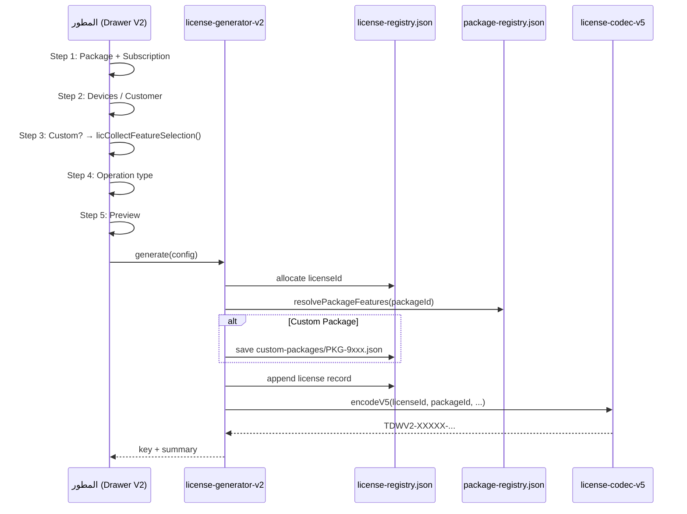
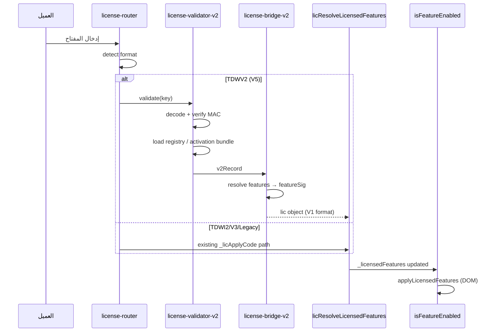
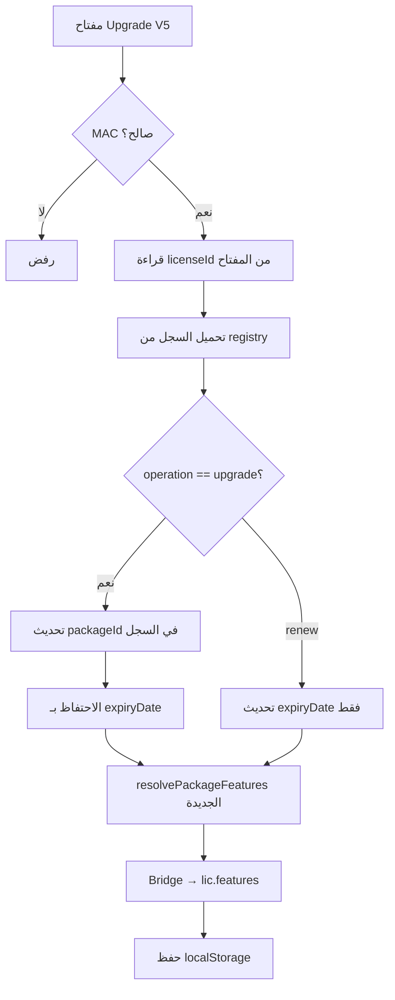

# License Engine V2 — وثيقة التصميم المعماري (ADD)

**الإصدار:** 1.0.0-draft  
**التاريخ:** 18 يونيو 2026  
**الحالة:** 🟡 **بانتظار الاعتماد — لا يُنفَّذ أي كود قبل الموافقة**  
**النطاق:** تصميم معماري فقط — Extension Layer فوق النظام الحالي (V1)

---

## جدول المحتويات

1. [الملخص التنفيذي](#1-الملخص-التنفيذي)
2. [المبادئ والقيود](#2-المبادئ-والقيود)
3. [هندسة التوازي (Parallel Architecture)](#3-هندسة-التوازي-parallel-architecture)
4. [هيكل الملفات](#4-هيكل-الملفات)
5. [Feature Registry](#5-feature-registry)
6. [Package Registry](#6-package-registry)
7. [Subscription Registry](#7-subscription-registry)
8. [License Registry](#8-license-registry)
9. [صيغة المفتاح V5 (ثابت الطول)](#9-صيغة-المفتاح-v5-ثابت-الطول)
10. [عمليات الترخيص](#10-عمليات-الترخيص)
11. [طبقة الجسر (V2 → V1 Bridge)](#11-طبقة-الجسر-v2--v1-bridge)
12. [مخططات تدفق البيانات](#12-مخططات-تدفق-البيانات)
13. [واجهة إنشاء التراخيص (Drawer Wizard)](#13-واجهة-إنشاء-التراخيص-drawer-wizard)
14. [التوافق مع النظام الحالي](#14-التوافق-مع-النظام-الحالي)
15. [خطة الترحيل (Migration Plan)](#15-خطة-الترحيل-migration-plan)
16. [مراحل التنفيذ (Phases)](#16-مراحل-التنفيذ-phases)
17. [تقييم المخاطر](#17-تقييم-المخاطر)
18. [قابلية التوسع المستقبلية](#18-قابلية-التوسع-المستقبلية)
19. [معايير القبول والاعتماد](#19-معايير-القبول-والاعتماد)

---

## 1. الملخص التنفيذي

**License Engine V2** ليس نظام ترخيص بديلًا. هو **طبقة تنظيمية وتجارية** تُبنى **بالتوازي** فوق المكوّنات الموجودة والمختبرة:

| المكوّن الحالي (V1) | دوره بعد V2 |
|---------------------|-------------|
| `FEATURE_REGISTRY` في `index.html` | **مصدر التشغيل الوحيد** — V2 يقرأ منه عبر جسر |
| `isFeatureEnabled()` | **بدون تغيير** — يستقبل `features` من الجسر |
| RBAC / Page Gates / Diagnostics | **بدون تغيير** |
| V3/V4 key validation | **يبقى نشطًا** لتراخيص قديمة |
| `licCollectFeatureSelection()` | **يُعاد استخدامه** في خطوة Custom |

**الفكرة المركزية:** المفتاح القصير يحمل **معرّفات** (License ID + Package ID + Subscription ID + حدود)، وليس **قائمة الخصائص**. الخصائص تُحلّ من `package-registry.json` أو من `license-registry.json` (للـ Custom).

```
Package ID  →  package-registry.json  →  feature keys[]
                                              ↓
                                    V2 Bridge Adapter
                                              ↓
                              lic.features + edition + featureSig
                                              ↓
                              isFeatureEnabled()  ←  V1 بدون تغيير
```

---

## 2. المبادئ والقيود

### 2.1 مبادئ إلزامية

| # | المبدأ |
|---|--------|
| P1 | **لا حذف لـ V1** حتى اجتياز V2 لجميع اختبارات PAT/FPA/FPV + اختبارات ترخيص مخصصة |
| P2 | **لا تعديل منطق V1** أثناء بناء V2 — فقط إضافة ملفات وطبقة جسر |
| P3 | **Feature Keys الحالية ثابتة** — لا إعادة تسمية لـ `book_schedule` وغيرها |
| P4 | **أي Feature جديد مستقبلي** = إدخال في `feature-registry.json` برقم ID جديد فقط |
| P5 | **أي باقة جديدة** = إدخال في `package-registry.json` فقط — بدون تعديل كود |
| P6 | **Opt-in features** تبقى معطّلة افتراضيًا حتى في Ultimate |
| P7 | **V2 قابل للتعطيل** عبر feature flag `LICENSE_ENGINE_V2_ENABLED` |

### 2.2 ما لن يُعاد بناؤه

- `FEATURE_REGISTRY` الداخلي في `index.html`
- `isFeatureEnabled` / `applyLicensedFeatures` / `data-feature` gates
- RBAC في `cupping-ext-modules.js`
- خوارزميات V3/V4 الحالية (تبقى للتوافق العكسي)
- لوحة Diagnostics و `licToggleRuntimeFeature`

### 2.3 ما سيُضاف

- مجلد `license/` بملفات JSON وJS معيارية
- `license-registry.json` (سجل التراخيص)
- محرك V2 للتوليد والتحقق والترقية
- واجهة Drawer جديدة (تستبدل UI التوليد فقط — ليس منطق التشغيل)
- جسر يحوّل سجل V2 → تنسيق `lic` الحالي في `localStorage`

---

## 3. هندسة التوازي (Parallel Architecture)

```
┌─────────────────────────────────────────────────────────────────┐
│                        APPLICATION (index.html)                    │
├─────────────────────────────────────────────────────────────────┤
│  UI Layer                                                        │
│  ┌──────────────────┐    ┌──────────────────────────────────┐ │
│  │ V1 License Panel │    │ V2 License Drawer (جديد)           │ │
│  │ (يبقى حتى Cutover)│    │ lic-v2-wizard.js                 │ │
│  └────────┬─────────┘    └──────────────┬───────────────────┘ │
│           │                              │                       │
│  ┌────────▼──────────────────────────────▼───────────────────┐ │
│  │              License Router (license-router.js)              │ │
│  │   if V2_ENABLED && key.startsWith('TDWV2') → V2 path        │ │
│  │   else → V1 path (V3/V4/Legacy)                             │ │
│  └────────┬──────────────────────────────┬───────────────────┘ │
│           │                              │                       │
│  ┌────────▼─────────┐          ┌──────────▼──────────────────┐  │
│  │   V1 Engine      │          │   V2 Engine                  │  │
│  │   (index.html)   │          │   license-engine-v2.js       │  │
│  │   بدون تعديل     │          │   + generator/validator      │  │
│  └────────┬─────────┘          └──────────┬──────────────────┘  │
│           │                              │                       │
│           │          ┌───────────────────▼───────────────────┐  │
│           │          │     V2 Bridge (license-bridge-v2.js)    │  │
│           │          │  → lic.features, edition, featureSig      │  │
│           │          │  → packageId, subscriptionId, devices     │  │
│           │          └───────────────────┬───────────────────┘  │
│           └──────────────────────────────┼───────────────────────┘
│                                          ▼
│  ┌─────────────────────────────────────────────────────────────┐ │
│  │  V1 Runtime (بدون تغيير)                                     │ │
│  │  licResolveLicensedFeatures() → isFeatureEnabled()         │ │
│  │  applyLicensedFeatures() → RBAC → Page Gates                 │ │
│  └─────────────────────────────────────────────────────────────┘ │
└─────────────────────────────────────────────────────────────────┘
```

### 3.1 استراتيجية Cutover

| المرحلة | السلوك |
|---------|--------|
| **Dev** | V1 + V2 معًا — `LICENSE_ENGINE_V2_ENABLED=true` للمطور فقط |
| **Beta** | V2 للتوليد الجديد؛ V1 يقرأ كل الصيغ |
| **Cutover** | UI التوليد V2 افتراضي؛ V1 validation يبقى |
| **Stable** | إزالة UI V1 القديم فقط — **لا حذف** لكود التحقق V3/V4 |

---

## 4. هيكل الملفات

```
license/
├── registries/
│   ├── feature-registry.json      # SSOT للخصائص (72 + مستقبلية)
│   ├── package-registry.json      # الباقات الجاهزة + قوالب
│   ├── subscription-registry.json # أنواع الاشتراك
│   └── operation-registry.json    # أنواع العمليات (new/renew/upgrade...)
│
├── data/
│   ├── license-registry.json      # سجل التراخيص (يُنشأ/يُحدَّث عند التوليد)
│   └── custom-packages/           # حزم Custom مؤقتة (PKG-9xxx)
│       └── PKG-9001.json
│
├── core/
│   ├── license-constants.js       # Magic, alphabets, flags
│   ├── license-codec-v5.js        # ترميز/فك V5 (25 حرف)
│   ├── license-crypto.js          # HMAC, PBKDF2 (يستدعي نفس LIC_SECRETS)
│   └── license-bridge-v2.js       # V2 record → V1 lic object
│
├── engine/
│   ├── license-engine-v2.js       # Orchestrator رئيسي
│   ├── license-generator-v2.js    # توليد أكواد + سجل
│   ├── license-validator-v2.js    # تحقق + تطبيق
│   ├── license-upgrade.js         # Upgrade / Upgrade+Renew
│   ├── license-downgrade.js       # Downgrade (مستقبلي)
│   └── license-migration.js       # V1 → V2 registry import
│
├── ui/
│   ├── license-v2-drawer.js       # Drawer wizard
│   ├── license-v2-drawer.css      # أنماط معزولة
│   └── license-v2-presets.js      # حفظ/استيراد/تصدير presets
│
└── license-router.js              # توجيه V1/V2

pat-reports/
└── LICENSE-ENGINE-V2-ADD-AR.md      # هذه الوثيقة
```

### 4.1 تحميل الملفات في Electron

```html
<!-- يُضاف بعد cupping-*.js وقبل index.html inline license block -->
<script src="license/core/license-constants.js"></script>
<script src="license/core/license-crypto.js"></script>
<script src="license/core/license-codec-v5.js"></script>
<script src="license/core/license-bridge-v2.js"></script>
<script src="license/engine/license-engine-v2.js"></script>
<!-- ... -->
<script src="license/license-router.js"></script>
```

**ملاحظة:** ملفات JSON تُحمّل عبر `fetch()` أو تُضمَّن في bundle وقت البناء — القرار في Phase 1.

---

## 5. Feature Registry

### 5.1 الغرض

- **معرّف رقمي ثابت** لكل خاصية — لا يتغير أبدًا بعد التعيين
- **Feature Key** الحالي (`rep_archive_a4`) يبقى المرجع في الكود
- V2 يستخدم الأرقام في السجلات؛ الجسر يحوّل إلى Keys لـ V1

### 5.2 مخطط JSON

```json
{
  "schemaVersion": 1,
  "features": [
    {
      "id": 33,
      "key": "rep_archive_a4",
      "name": "أرشيف التقارير الشهرية A4",
      "nameEn": "Monthly Archive",
      "group": "reports_print",
      "module": "reports",
      "page": "reports",
      "type": "addon",
      "tier": "addon",
      "isCore": false,
      "isAddon": true,
      "isDeveloper": false,
      "isDiagnostics": false,
      "optIn": false,
      "unique": true,
      "sort": 8,
      "cap": "cap_reports",
      "deprecated": false,
      "mergeWith": null,
      "sellableAsAddon": true,
      "notes": "يُباع كـ Add-on منفصل"
    }
  ]
}
```

### 5.3 قواعد التعيين

| القاعدة | التفاصيل |
|---------|----------|
| ID Range 1–8 | Core features — دائمًا مفعّلة |
| ID Range 9–72 | Add-ons الحالية (مرتبة حسب `FEATURE_REGISTRY`) |
| ID Range 73–255 | محجوز للمستقبل |
| ID Range 256+ | ميزات تجريبية / داخلية |
| **ممنوع** | إعادة استخدام ID محذوف — `deprecated: true` فقط |

### 5.4 جدول التعيين الكامل (72 خاصية)

> **مرجع المصدر:** `FEATURE_REGISTRY` في `index.html` سطور 19952–20025  
> الأرقام تُعيَّن مرة واحدة ولا تتغير.

| ID | Key | النوع | Opt-in | المجموعة |
|----|-----|-------|--------|----------|
| 1 | `core_dashboard` | core | — | core |
| 2 | `core_pos` | core | — | core |
| 3 | `core_clients` | core | — | core |
| 4 | `core_staff` | core | — | core |
| 5 | `core_packages` | core | — | core |
| 6 | `core_users` | core | — | core |
| 7 | `core_settings` | core | — | core |
| 8 | `core_employee` | core | — | core |
| 9 | `book_schedule` | addon | — | patients_visits |
| 10 | `book_confirm` | addon | — | patients_visits |
| 11 | `book_no_show` | addon | — | patients_visits |
| 12 | `dash_book_kpi` | addon | — | patients_visits |
| 13 | `pos_shared_pkg` | addon | — | patients_visits |
| 14 | `pos_multi_svc` | addon | — | patients_visits |
| 15 | `pos_receipt` | addon | — | patients_visits |
| 16 | `msg_templates` | addon | — | patients_visits |
| 17 | `msg_bulk` | addon | — | patients_visits |
| 18 | `msg_auto` | addon | — | patients_visits |
| 19 | `msg_retention` | addon | — | patients_visits |
| 20 | `dash_msg_alert` | addon | — | patients_visits |
| 21 | `crm_invoice_search` | addon | — | patients_visits |
| 22 | `crm_search` | addon | — | patients_visits |
| 23 | `ops_client_file` | addon | — | patients_visits |
| 24 | `ops_map_editor` | addon | — | patients_visits |
| 25 | `rep_monthly` | addon | — | reports_print |
| 26 | `rep_doctors` | addon | — | reports_print |
| 27 | `rep_vat` | addon | — | reports_print |
| 28 | `rep_zreport` | addon | — | reports_print |
| 29 | `rep_profitability` | addon | — | reports_print |
| 30 | `rep_sales` | addon | — | reports_print |
| 31 | `rep_thermal_period` | addon | — | reports_print |
| 32 | `rep_archive_a4` | addon | — | reports_print |
| 33 | `tech_print_pdf` | addon | — | reports_print |
| 34 | `exp_track` | addon | — | advanced |
| 35 | `exp_budget` | addon | — | advanced |
| 36 | `dash_exp_kpi` | addon | — | advanced |
| 37 | `pkg_bank` | addon | — | advanced |
| 38 | `fin_currency` | addon | — | advanced |
| 39 | `fin_cashfloat` | addon | — | advanced |
| 40 | `ops_inventory` | addon | — | advanced |
| 41 | `att_daily` | addon | — | hr_payroll |
| 42 | `att_leave` | addon | — | hr_payroll |
| 43 | `hr_leave_requests` | addon | — | hr_payroll |
| 44 | `att_overtime` | addon | — | hr_payroll |
| 45 | `pay_salary` | addon | — | hr_payroll |
| 46 | `pay_commission` | addon | — | hr_payroll |
| 47 | `hr_ledger` | addon | — | hr_payroll |
| 48 | `att_report` | addon | — | hr_payroll |
| 49 | `att_policy` | addon | — | hr_payroll |
| 50 | `pkg_commissions` | addon | — | hr_payroll |
| 51 | `hw_drawer` | addon | — | developer_tools |
| 52 | `hw_thermal` | addon | — | developer_tools |
| 53 | `hw_status` | addon | — | developer_tools |
| 54 | `bk_local` | addon | — | backup_restore |
| 55 | `bk_custom` | addon | — | backup_restore |
| 56 | `bk_cloud` | addon | — | backup_restore |
| 57 | `bk_drive` | addon | — | backup_restore |
| 58 | `tech_import` | addon | — | developer_tools |
| 59 | `tech_msg_api` | addon | — | communication |
| 60 | `tech_gateway` | addon | **opt-in** | communication |
| 61 | `hr_leave_balance` | addon | — | hr_payroll |
| 62 | `sys_setup_wizard` | addon | — | diagnostics |
| 63 | `sys_product_tour` | addon | **opt-in** | diagnostics |
| 64 | `sys_health_check` | addon | **opt-in** | diagnostics |
| 65 | `sys_readiness` | addon | — | diagnostics |
| 66 | `sys_integrity` | addon | **opt-in** | diagnostics |
| 67 | `sys_logs` | addon | — | developer_tools |
| 68 | `lux_queue_board` | addon | — | advanced |
| 69 | `lux_queue_print` | addon | — | advanced |
| 70 | `lux_queue_display` | addon | — | advanced |
| 71 | `lux_vip` | addon | — | advanced |
| 72 | `lux_rush` | addon | — | advanced |

### 5.5 العلاقة مع `FEATURE_REGISTRY` في V1

```
feature-registry.json  ──sync──►  FEATURE_REGISTRY (index.html)
         │                              │
         │         build-time أو         │
         │         runtime merge         │
         └──────────────────────────────►│
                                         ▼
                              isFeatureEnabled(key)  ← يستخدم key وليس id
```

**Phase 1:** `feature-registry.json` يُولَّد من `FEATURE_REGISTRY` بسكربت — مصدر الحقيقة يبقى V1 حتى Cutover.  
**Phase 3+:** `feature-registry.json` يصبح SSOT؛ سكربت يتحقق من التطابق.

---

## 6. Package Registry

### 6.1 مخطط JSON

```json
{
  "schemaVersion": 1,
  "packages": [
    {
      "id": 3,
      "key": "professional",
      "name": "Professional",
      "nameAr": "احترافي",
      "description": "مراكز متوسطة — HR + تقارير متقدمة",
      "color": "#2980b9",
      "icon": "💼",
      "price": null,
      "devices": 3,
      "branches": 2,
      "maxUsers": 15,
      "inherits": 2,
      "featureIds": [9, 10, 11, 12, 15, 16, 25, 27, 28, 41, 42, 45, 46, 47, 32],
      "addonFeatureIds": [32, 57],
      "diagnosticsAllowed": [62, 65],
      "optInExcluded": [63, 64, 66, 60],
      "editable": true,
      "visible": true,
      "order": 3
    }
  ]
}
```

### 6.2 الباقات المعرفة

| ID | Key | الاسم | يرث من | أجهزة | فروع | ملاحظات |
|----|-----|-------|--------|-------|------|---------|
| 1 | `starter` | Starter | — | 1 | 1 | نقطة دخول |
| 2 | `standard` | Standard | 1 | 2 | 1 | + HR أساسي |
| 3 | `professional` | Professional | 2 | 3 | 2 | + عمولات وأرشيف |
| 4 | `enterprise` | Enterprise | 3 | 5 | 5 | + أدوات متقدمة |
| 5 | `ultimate` | Ultimate | 4 | 0=∞ | 0=∞ | كل شيء − opt-in |
| 6 | `developer` | Developer | 5 | ∞ | ∞ | + أدوات مطور |
| 7 | `clinic` | Clinic | 2 | 3 | 1 | Preset عمودي — عيادة |
| 8 | `hospital` | Hospital | 4 | 10 | 3 | Preset عمودي — مستشفى |
| 9 | `custom` | Custom | — | يدوي | يدوي | يستخدم License Registry |

> `devices: 0` و `branches: 0` = غير محدود (يُرمَّز 0xF في المفتاح)

### 6.3 حل الخصائص (Feature Resolution)

```javascript
// Pseudocode — license-engine-v2.js
function resolvePackageFeatures(packageId) {
  const pkg = getPackage(packageId);
  if (pkg.inherits) {
    const parent = resolvePackageFeatures(pkg.inherits);
    return mergeFeatureSets(parent, pkg.featureIds);
  }
  return coreFeatureIds().concat(pkg.featureIds);
}
// ثم: apply optInExcluded → كل opt-in = false
// ثم: Bridge → { [key]: boolean }
```

### 6.4 Custom Package (PKG 9000–9999)

عند اختيار Custom:

1. المطور يختار features عبر `licCollectFeatureSelection()` الحالي
2. V2 ينشئ `custom-packages/PKG-9xxx.json`:

```json
{
  "packageId": 9001,
  "type": "custom",
  "featureKeys": { "book_schedule": true, "rep_archive_a4": true },
  "createdAt": "2026-06-18",
  "createdBy": "activation_admin",
  "label": "عميل XYZ — باقة خاصة"
}
```

3. يُسجَّل في `license-registry.json` مع `packageId: 9001`
4. المفتاح يحمل `packageId=9001` فقط — **لا features في المفتاح**

---

## 7. Subscription Registry

### 7.1 مخطط JSON

```json
{
  "schemaVersion": 1,
  "subscriptions": [
    {
      "id": 5,
      "key": "annual",
      "name": "Annual",
      "nameAr": "سنوي",
      "days": 365,
      "renewable": true,
      "upgradeAllowed": true,
      "downgradeAllowed": false,
      "trial": false,
      "internal": false
    }
  ]
}
```

### 7.2 الأنواع المعرفة

| ID | Key | الأيام | يتجدد | ترقية | ملاحظات |
|----|-----|--------|-------|-------|---------|
| 1 | `trial` | 7 | ❌ | ❌ | تجريبي |
| 2 | `monthly` | 30 | ✅ | ✅ | |
| 3 | `quarterly` | 90 | ✅ | ✅ | |
| 4 | `semi_annual` | 180 | ✅ | ✅ | يطابق `biannual` في V1 |
| 5 | `annual` | 365 | ✅ | ✅ | |
| 6 | `two_years` | 730 | ✅ | ✅ | |
| 7 | `three_years` | 1095 | ✅ | ✅ | |
| 8 | `five_years` | 1825 | ✅ | ✅ | |
| 9 | `lifetime` | 0 | ❌ | ✅ | `expiry` = 2099-12-31 |
| 10 | `developer` | 0 | ❌ | — | داخلي للمطور |
| 11 | `internal` | 0 | ❌ | — | استخدام داخلي NajjarTech |

> **الربط بـ V1:** `lic-gen-type` values (`trial`, `monthly`, …) تُعاد تسميتها عبر mapping table في Bridge — بدون تغيير V1.

---

## 8. License Registry

### 8.1 الغرض

**المصدر المرجعي الوحيد** لـ:
- توليد المفاتيح (يُنشأ السجل **قبل** المفتاح)
- التفعيل (يُقرأ السجل بـ License ID)
- الترقية / التجديد / التتبع التجاري

### 8.2 مخطط سجل الترخيص

```json
{
  "schemaVersion": 1,
  "licenses": [
    {
      "licenseId": 1042,
      "licenseKey": "TDWV2-K7H9P-43JTX-M8A2Q-8VPMP",
      "packageId": 3,
      "packageKey": "professional",
      "subscriptionId": 5,
      "operation": "new",
      "status": "pending",
      "devices": 3,
      "branches": 2,
      "maxUsers": 15,
      "deviceBinding": "DEVICE_ANY",
      "issueDate": "2026-06-18",
      "expiryDate": "2027-06-18",
      "featureKeys": null,
      "featureSig": null,
      "customer": {
        "name": "أحمد محمد",
        "phone": "+9665xxxxxxxx",
        "clinic": "مركز تداوي المدينة"
      },
      "notes": "عقد سنوي — دفعة أولى",
      "generatedBy": "activation_admin",
      "generatedAt": "2026-06-18T10:30:00Z",
      "activatedAt": null,
      "activatedDevice": null,
      "upgradeHistory": [],
      "renewHistory": [],
      "tokens": ["V5-1042-..."]
    }
  ],
  "nextLicenseId": 1043,
  "nextCustomPackageId": 9002
}
```

### 8.3 تخزين السجل

| البيئة | الموقع | الوصول |
|--------|--------|--------|
| **مطور (توليد)** | `license/data/license-registry.json` | لوحة المطور — قراءة/كتابة |
| **عميل (تفعيل)** | لا يحتاج السجل الكامل — فقط المفتاح + نسخة مدمجة عند التفعيل | |
| **مستقبلًا** | Activation Server DB | Phase 4+ |

### 8.4 تدفق التفعيل مع السجل

```
مفتاح V5 → فك الترميز → licenseId=1042
                              ↓
              قراءة license-registry (عند المطور)
              أو payload مُوقَّع مُرفق (offline bundle)
                              ↓
              التحقق: HMAC(key_fields) == mac في المفتاح
                              ↓
              resolvePackageFeatures(packageId)
                              ↓
              Bridge → lic object → localStorage
```

**للتفعيل Offline على جهاز العميل:** عند التوليد، يُنشأ `activation-bundle` مُوقَّع يحتوي الحقول الضرورية (بدون السجل الكامل) ويُخزَّن داخل `lic.v2meta` بعد التفعيل الأول.

---

## 9. صيغة المفتاح V5 (ثابت الطول)

### 9.1 المتطلبات

- طول ثابت: **25 حرف** (5 مجموعات × 5) — نفس تجربة V4
- Magic جديد: **`TDWV2`** (يميّز عن V4 `TDWI2`)
- **لا علاقة لطول المفتاح بعدد الخصائص**
- يدعم: License ID, Package ID, Subscription ID, Expiry, Devices, Branches, Operation, MAC

### 9.2 تخطيط البتات (100 bit payload → 20 char base32)

```
┌────────────────────────────────────────────────────────────────┐
│ Magic (5 chars)     │ TDWV2 — ثابت                           │
│ License Ref (5 chars)│ ترميز 26-bit من licenseId % 26^5      │
│ Payload (15 chars)  │ 75 bits — انظر الجدول أدناه            │
└────────────────────────────────────────────────────────────────┘
المجموع: 25 حرف = XXXXX-XXXXX-XXXXX-XXXXX-XXXXX
```

**75-bit Payload:**

| الحقل | Bits | النطاق | ملاحظات |
|-------|------|--------|---------|
| `mac29` | 21 | 0–2M | HMAC truncated |
| `operation` | 3 | 0–7 | new/renew/upgrade/... |
| `subscriptionId` | 4 | 0–15 | من subscription-registry |
| `packageId` | 8 | 0–255 | 9=custom, 90xx→mod 256 + registry |
| `devices` | 4 | 0–15 | 15=unlimited |
| `branches` | 4 | 0–15 | 15=unlimited |
| `deviceHash` | 8 | 0–255 | 0xFF=any device |
| `licenseId` | 16 | 0–65535 | المعرّف الكامل |
| `expiryDays` | 13 | 0–8191 | أيام منذ epoch 2020-01-01 |

> `issueDate` يُستنتج من السجل أو يُخزَّن في `activation-bundle` — لا يُشفَّر في المفتاح لتوفير bits (مثل V4).

### 9.3 حساب MAC

```javascript
// نفس licGetSigningKey() — لا secrets جديدة
const msg = `TDWV2|${licenseId}|${packageId}|${subscriptionId}|${operation}|${expiryDays}|${devices}|${branches}|${deviceHash}`;
const mac29 = hmacTruncated(msg, 21);
```

### 9.4 مقارنة الصيغ

| الصيغة | الطول | يحمل features؟ | الاستخدام |
|--------|-------|----------------|-----------|
| Legacy | متغير | ✅ | توافق قديم |
| V3 | 80–200+ | ✅ JSON مشفّر | Custom V1 |
| V4 (`TDWI2`) | 25 | ❌ Full only | إصدار كامل V1 |
| **V5 (`TDWV2`)** | **25** | **❌** | **كل الباقات + Custom** |

### 9.5 Custom Package ID > 255

للـ Package IDs 9000–9999:
- المفتاح يحمل `packageId & 0xFF` (byte منخفض)
- `licenseId` في السجل يشير إلى `custom-packages/PKG-9xxx.json`
- التحقق يتم عبر `licenseId` → registry lookup (ليس عبر byte وحده)

---

## 10. عمليات الترخيص

### 10.1 أنواع العمليات

| Code | العملية | السلوك |
|------|---------|--------|
| 0 | `new` | ترخيص جديد — سجل + مفتاح |
| 1 | `renew` | نفس الباقة — `expiry` جديد فقط |
| 2 | `upgrade` | باقة أعلى — **expiry بدون تغيير** |
| 3 | `upgrade_renew` | باقة أعلى + `expiry` جديد |
| 4 | `downgrade` | باقة أدنى — يتطلب تأكيد (مستقبلي) |
| 5 | `developer` | باقة developer — داخلي |
| 6 | `internal` | استخدام NajjarTech |

### 10.2 Upgrade (بدون تغيير Expiry)

```
Input: licenseId=1042 (Professional, expiry=2027-06-18)
Operation: upgrade → packageId=4 (Enterprise)

1. قراءة السجل الحالي
2. التحقق: subscription.upgradeAllowed == true
3. تحديث السجل:
   - packageId: 3 → 4
   - upgradeHistory.push({ from:3, to:4, date, by })
   - expiryDate: بدون تغيير ✓
4. إعادة حل features من Enterprise package
5. توليد مفتاح V5 جديد (operation=2)
6. عند التطبيق على جهاز العميل:
   - Bridge يحدّث lic.features
   - lic.expiry يبقى كما هو
```

### 10.3 Renewal Only

```
operation=1, packageId=بدون تغيير
expiryDate = today + subscription.days
renewHistory.push({ date, subscriptionId, previousExpiry })
```

### 10.4 Upgrade + Renewal

```
operation=3
packageId → جديد
expiryDate → today + subscription.days
```

### 10.5 Downgrade

```
operation=4
يتطلب: subscription.downgradeAllowed (افتراضي false)
يُنفَّذ في Phase 3 — مع تحذير بفقدان features
```

---

## 11. طبقة الجسر (V2 → V1 Bridge)

### 11.1 الغرض

تحويل نتيجة V2 إلى كائن `lic` المتوافق مع `licResolveLicensedFeatures()` **بدون تعديلها**.

### 11.2 التحويل

```javascript
// license-bridge-v2.js — pseudocode
async function bridgeV2ToV1License(v2Record) {
  const featureKeys = v2Record.featureKeys
    || await resolvePackageToFeatureKeys(v2Record.packageId);

  const features = keysToV1FeaturesObject(featureKeys); // { key: bool }
  const isFull = isFullFeatureSet(features);

  const lic = {
    type: 'renew',
    v: 5,
    edition: isFull ? 'full' : 'custom',
    expiry: v2Record.expiryDate,
    issued: v2Record.issueDate,
    activationDate: v2Record.activatedAt || v2Record.issueDate,
    licType: mapSubscriptionToV1Type(v2Record.subscriptionId),
    device: v2Record.deviceBinding || 'DEVICE_ANY',
    licenseId: v2Record.licenseId,
    token: v2Record.tokens[v2Record.tokens.length - 1],
    // V2 metadata — يتجاهله V1
    v2meta: {
      packageId: v2Record.packageId,
      packageKey: v2Record.packageKey,
      subscriptionId: v2Record.subscriptionId,
      devices: v2Record.devices,
      branches: v2Record.branches,
      operation: v2Record.operation
    }
  };

  if (!isFull) {
    lic.features = features;
    lic.featureSig = await licSignFeaturesObject(features); // دالة V1 الموجودة
  }

  return lic;
}
```

### 11.3 نقاط الربط في V1 (تعديلات طفيفة — Phase 3 فقط)

| الموقع | التعديل | الحجم |
|--------|---------|-------|
| `_licApplyCode()` | إضافة فرع: `if (licRouter.isV2(key)) → v2Validator` | ~15 سطر |
| `licGenerateRenewalCode()` | لا يُمس — V2 UI منفصل | 0 |
| `licResolveLicensedFeatures()` | **بدون تغيير** | 0 |
| `isFeatureEnabled()` | **بدون تغيير** | 0 |

---

## 12. مخططات تدفق البيانات

### 12.1 دورة إنشاء الترخيص



### 12.2 دورة التفعيل والتحقق



### 12.3 تدفق الترقية



---

## 13. واجهة إنشاء التراخيص (Drawer Wizard)

### 13.1 التصميم العام

- **Drawer جانبي** بعرض 480px — يُفتح من تبويب "تجديد ومفاتيح" في لوحة المطور
- **لا يحل محل** تبويبات التفعيل/Diagnostics — يحل محل **قسم التوليد القديم** فقط
- يعمل **بالتوازي** — زر "الوضع الكلاسيكي" يُظهر UI V1

### 13.2 الخطوات

| الخطوة | المحتوى | يعيد استخدام |
|--------|---------|--------------|
| **1** | Package cards + Subscription select | `package-registry.json` |
| **2** | Devices, Branches, MaxUsers, Customer, Notes | جديد |
| **3** | Feature Picker (إذا Custom فقط) | `licCollectFeatureSelection()` + `lic-feat-panel` |
| **4** | Operation: New / Renew / Upgrade / Upgrade+Renew / Downgrade / Dev / Internal | `operation-registry.json` |
| **5** | Preview + Generate | `license-generator-v2` |

### 13.3 معاينة ما قبل التوليد

```
┌─────────────────────────────────────────┐
│  📋 ملخص الترخيص                        │
├─────────────────────────────────────────┤
│  Package:        Professional 💼         │
│  Subscription:   Annual (365 days)       │
│  Operation:      New License             │
│  Edition:        Package (38 features)   │
│  Add-ons:        2 selected              │
│  Devices:        3                       │
│  Branches:       2                       │
│  Expiry:         18-06-2027              │
│  Customer:       مركز تداوي المدينة      │
└─────────────────────────────────────────┘
         [ ← رجوع ]    [ 🔑 Generate ]
```

### 13.4 بعد التوليد

```
┌─────────────────────────────────────────┐
│  ✅ تم توليد المفتاح                     │
│  ┌───────────────────────────────────┐  │
│  │ TDWV2-K7H9P-43JTX-M8A2Q-8VPMP    │  │
│  └───────────────────────────────────┘  │
│  📋 Copy   📋 Copy All   💾 Export      │
│  25 chars │ Professional │ Annual         │
│  3 devices │ 2 branches │ exp: 2027-06-18│
└─────────────────────────────────────────┘
```

### 13.5 UX إضافي

| الميزة | التنفيذ |
|--------|---------|
| بحث في الخصائص | فلترة `lic-feat-panel` الحالي بـ `data-feat-label` |
| تمييز Add-ons / Opt-in / Diagnostics | CSS classes من `feature-registry.json` |
| عدد الخصائص المحددة | `lic-feat-meta-*` الموجود |
| حفظ Preset | `license-v2-presets.js` → localStorage |
| استيراد/تصدير باقات | JSON import/export لـ `package-registry` (مطور فقط) |

---

## 14. التوافق مع النظام الحالي

### 14.1 مصفوفة التوافق

| المكوّن | V1 | V2 | التفاعل |
|---------|----|----|---------|
| `FEATURE_REGISTRY` | ✅ | يقرأ | Bridge يستخدم keys |
| `isFeatureEnabled` | ✅ | ✅ | بدون تغيير |
| `data-feature` gates | ✅ | ✅ | بدون تغيير |
| RBAC | ✅ | ✅ | منفصل — لا يتأثر |
| V4 keys | ✅ | ✅ | Router → V1 path |
| V3 Custom keys | ✅ | ✅ | Router → V1 path |
| `licToggleRuntimeFeature` | ✅ | ✅ | opt-in بعد التفعيل |
| Diagnostics panel | ✅ | ✅ | بدون تغيير |

### 14.2 تراخيص العملاء الحاليين

- **لا تحتاج إعادة تفعيل** — V1 validation يبقى للأبد
- اختياري: `license-migration.js` يستورد تراخيص `localStorage` إلى registry للمطور

### 14.3 اختبارات التوافق المطلوبة قبل Cutover

| الاختبار | المعيار |
|----------|---------|
| تفعيل V4 قديم | ✅ يعمل عبر V1 path |
| تفعيل V3 Custom قديم | ✅ يعمل |
| تفعيل V5 جديد | ✅ يعمل عبر V2 path |
| `isFeatureEnabled` بعد V5 | ✅ مطابق لاختيار الباقة |
| Opt-in بعد Ultimate | ✅ معطّلة |
| PAT / FPA / FPV | ✅ 0 FAIL |
| Upgrade بدون expiry change | ✅ |
| Renewal | ✅ |

---

## 15. خطة الترحيل (Migration Plan)

### 15.1 ترحيل البيانات

```
المرحلة A — تصدير (اختياري):
  localStorage.lic → license-migration.js → license-registry.json

المرحلة B — التشغيل المتوازي:
  V1 + V2 مع LICENSE_ENGINE_V2_ENABLED=true للمطور

المرحلة C — Cutover UI:
  Drawer V2 افتراضي للتوليد
  V1 generation UI مخفي (لا محذوف)

المرحلة D — إنتاج:
  عملاء جدد → V5 keys
  عملاء قدامى → V3/V4 يعمل بدون تغيير
```

### 15.2 Rollback Plan

| الحالة | الإجراء |
|--------|---------|
| فشل V2 في الإنتاج | `LICENSE_ENGINE_V2_ENABLED=false` — عودة فورية لـ V1 UI |
| مفتاح V5 تالف | لا يؤثر على V4/V3 — عزل كامل |
| registry تالف | استعادة من backup `license-registry.json.bak` |

### 15.3 لا يُرحَّل (يبقى في V1)

- خوارزمية V3/V4
- `FEATURE_REGISTRY` inline (حتى Phase 5)
- Token reuse list (`licIsTokenUsed`)

---

## 16. مراحل التنفيذ (Phases)

### Phase 0 — الاعتماد (الحالي) ⏳

- [ ] مراجعة هذه الوثيقة
- [ ] اعتماد جدول Feature IDs
- [ ] اعتماد Package definitions
- [ ] اعتماد V5 bit layout
- **لا كود**

### Phase 1 — الأساس (منخفض المخاطر)

| المهمة | الملفات | المخاطر |
|--------|---------|---------|
| إنشاء `feature-registry.json` من FEATURE_REGISTRY | سكربت build | منخفض |
| `package-registry.json` + `subscription-registry.json` | JSON | منخفض |
| `license-constants.js` + `license-crypto.js` | JS | منخفض |
| Unit tests للـ codec | tests | منخفض |

**معيار القبول:** JSON صالح + تطابق 72 feature مع V1

### Phase 2 — المحرك (متوسط)

| المهمة | الملفات |
|--------|---------|
| `license-codec-v5.js` | ترميز/فك |
| `license-engine-v2.js` | orchestrator |
| `license-generator-v2.js` | توليد + registry |
| `license-validator-v2.js` | تحقق |
| `license-bridge-v2.js` | V2→V1 |
| `license-router.js` | توجيه |

**معيار القبول:** توليد + تفعيل V5 في بيئة dev بدون لمس UI

### Phase 3 — العمليات (متوسط)

| المهمة | الملفات |
|--------|---------|
| `license-upgrade.js` | upgrade / upgrade+renew |
| `license-downgrade.js` | downgrade |
| `license-migration.js` | استيراد V1 |
| ربط `_licApplyCode` بـ router | ~15 سطر في index.html |

**معيار القبول:** Upgrade يحافظ على expiry — Renewal يحدّثه

### Phase 4 — الواجهة (منخفض-متوسط)

| المهمة | الملفات |
|--------|---------|
| `license-v2-drawer.js` + CSS | Wizard 5 خطوات |
| Copy All / Export | UX |
| Presets import/export | |

**معيار القبول:** توليد Professional Annual من Drawer = نفس features يدويًا

### Phase 5 — الاختبار والCutover

| المهمة | |
|--------|--|
| اختبار ترخيص شامل (50+ سيناريو) | |
| PAT + FPA + FPV | 0 FAIL |
| تفعيل V2 للمطور في production | |
| إخفاء UI V1 التوليد | |

### Phase 6 — ما بعد الإطلاق

- Activation Server
- Cloud Licensing
- Customer Portal
- Floating Licenses

---

## 17. تقييم المخاطر

| المخاطرة | الاحتمال | التأثير | التخفيف |
|----------|----------|---------|---------|
| Regression في `isFeatureEnabled` | متوسط | عالي | Bridge فقط — لا تعديل V1 logic |
| تعارض V4/V5 في Router | منخفض | متوسط | Magic bytes مختلفة (`TDWI2` vs `TDWV2`) |
| فقدان registry | منخفض | عالي | backup تلقائي + export |
| Custom package ID collision | منخفض | متوسط | `nextCustomPackageId` atomic |
| تسريب secrets | موجود مسبقًا | عالي | لا secrets جديدة — نفس PBKDF2 |
| تأخير الإطلاق التجاري | متوسط | عالي | **V2 بعد Code Freeze** — البيع بـ V1 الآن |
| تعقيد Drawer يكسر لوحة المطور | منخفض | متوسط | UI معزول — fallback لـ V1 |

### 17.1 توصية التوقيت

| السيناريو | التوصية |
|-----------|---------|
| **قبل الإطلاق التجاري + Code Freeze** | ❌ لا تنفيذ Phase 2–5 |
| **بعد الإطلاق (v2.1)** | ✅ Phase 1–4 تدريجيًا |
| **البيع الحالي** | Full Edition V4 + Custom V3 |

---

## 18. قابلية التوسع المستقبلية

الهندسة تدعم بدون إعادة تصميم:

| القدرة | نقطة الربط |
|--------|-----------|
| **Multi-Branch** | `branches` في registry + RBAC لاحقًا |
| **Cloud Licensing** | `license-registry` → API sync |
| **Activation Server** | `license-validator-v2` → remote verify |
| **Online Validation** | MAC + server nonce |
| **Floating Licenses** | `devices` + checkout/checkin في registry |
| **Device Transfer** | `deviceBinding` update + مفتاح transfer |
| **Offline Activation** | `activation-bundle` موقّع |
| **Customer Portal** | قراءة registry عبر API |
| **License Dashboard** | `license-registry.json` → UI |
| **Subscription Billing** | `subscriptionId` + `renewHistory` |

```
                    ┌─────────────────────┐
                    │  Activation Server   │  (Phase 6+)
                    └──────────┬──────────┘
                               │ sync
┌──────────────┐    ┌──────────▼──────────┐    ┌─────────────┐
│ package-     │───►│  License Engine V2   │◄───│ subscription│
│ registry     │    │  (offline-first)     │    │ registry    │
└──────────────┘    └──────────┬──────────┘    └─────────────┘
                               │
                    ┌──────────▼──────────┐
                    │  V1 Runtime (stable) │
                    └─────────────────────┘
```

---

## 19. معايير القبول والاعتماد

### 19.1 قائمة اعتماد الوثيقة

يرجى مراجعة والموافقة على:

- [ ] **هيكل الملفات** (القسم 4)
- [ ] **جدول Feature IDs 1–72** (القسم 5.4) — **ثابت بعد الاعتماد**
- [ ] **تعريفات الباقات 1–9** (القسم 6.2)
- [ ] **أنواع الاشتراك 1–11** (القسم 7.2)
- [ ] **مخطط License Registry** (القسم 8)
- [ ] **V5 bit layout + Magic `TDWV2`** (القسم 9)
- [ ] **عمليات Upgrade/Renew/Downgrade** (القسم 10)
- [ ] **تصميم Drawer Wizard** (القسم 13)
- [ ] **خطة المراحل والتوقيت** (الأقسام 16–17)

### 19.2 بعد الاعتماد

1. إنشاء فرع `cursor/license-engine-v2-phase1-d976`
2. تنفيذ Phase 1 فقط (JSON + constants)
3. PR منفصل لكل Phase
4. لا Cutover قبل 0 FAIL في اختبارات الترخيص

### 19.3 تعليقات / تعديلات

| البند | القرار | الملاحظات |
|-------|--------|-----------|
| Magic V5: `TDWV2` vs `TDWI3` | `TDWV2` مقترح | يميّز بوضوح عن V4 |
| Custom PKG range: 9000–9999 | مقترح | 999 باقة custom كافية |
| registry: JSON file vs SQLite | JSON أولًا | Electron: يمكن SQLite لاحقًا |
| Issue date في المفتاح | خارج المفتاح | يُخزَّن في registry فقط |

---

## الملحق أ — مرجع V1 (للمقارنة)

| الدالة V1 | الموقع | دورها بعد V2 |
|-----------|--------|--------------|
| `licBuildV4ProductKey` | index.html ~19380 | يبقى — Full Edition |
| `licEncryptedToProductKey` | index.html | يبقى — Custom V1 |
| `licCollectFeatureSelection` | index.html ~20233 | **يُعاد استخدامه** |
| `licAttachFeaturesToLicense` | index.html ~20214 | يُستدعى من Bridge |
| `licResolveLicensedFeatures` | index.html ~20198 | **بدون تغيير** |
| `isFeatureEnabled` | index.html ~20459 | **بدون تغيير** |
| `licGenerateRenewalCode` | index.html ~21331 | يُستبدل UI فقط في Phase 4 |

---

## الملحق ب — مرجع التقرير التحليلي السابق

راجع `pat-reports/LICENSE-ANALYSIS-AR.md` لتفاصيل:
- جرد الـ 72 خاصية مع حالة الواجهة
- الباقات المقترحة (Starter → Ultimate)
- Add-ons المستقلة
- توصية التأجيل قبل الإطلاق

**هذه الوثيقة (ADD)** هي المستند التنفيذي المعتمد — التقرير السابق كان تحليلًا استكشافيًا.

---

*وثيقة تصميم معمارية — License Engine V2 — NajjarTech / تداوي*  
*الإصدار 1.0.0-draft — بانتظار اعتماد المستخدم قبل أي تنفيذ*
